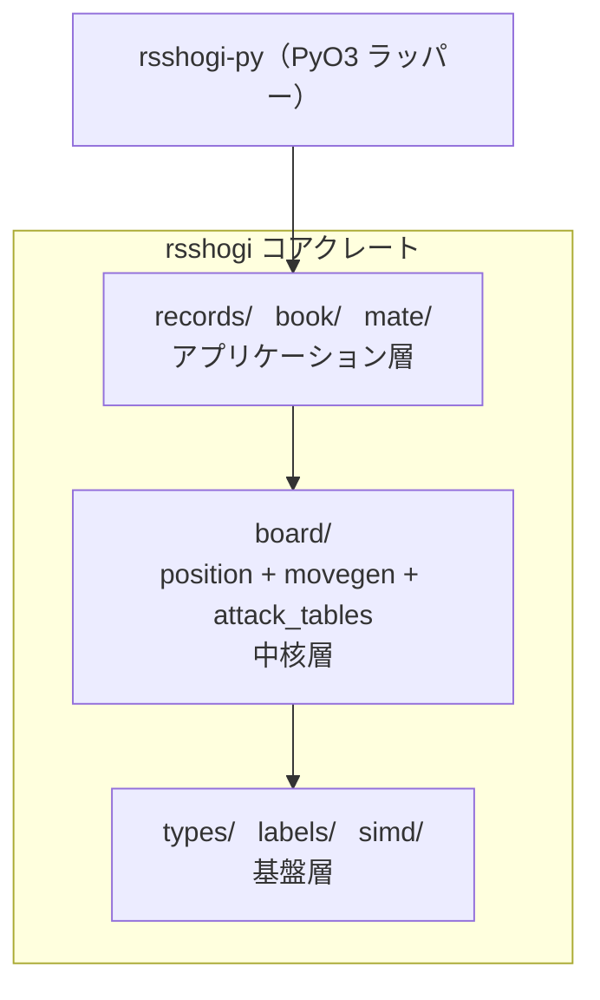

# 全体アーキテクチャ

rsshogi は Cargo ワークスペースとして構成され、コアクレートと Python バインディングクレートの 2 つから成ります。

## クレート構成

| クレート | パス | 役割 |
|---------|------|------|
| `rsshogi` | `crates/rsshogi/` | 盤面表現、合法手生成、棋譜処理などのコア機能 |
| `rsshogi-py` | `crates/rsshogi-py/` | PyO3 による Python バインディング（薄いラッパー） |

`rsshogi-py` はクレート名で、ビルド後の Python パッケージ名は `rsshogi` です。
`pip install rsshogi` で入るのはこちらです。

## rsshogi コアクレートのモジュール構成

```text
rsshogi/src/
├── types/       基本型（Color, Square, Piece, Move, Move32, Bitboard, Hand）
├── labels/      学習・推論向けのラベル変換（policy ラベルなど）
├── board/       局面管理と指し手生成（最大のモジュール）
│   ├── position/      局面の保持、更新、合法性判定、Zobrist ハッシュ
│   ├── movegen/       駒種別の指し手生成（盤上移動、駒打ち、王手回避）
│   ├── attack_tables/ 利きテーブル（LZ/TZ 法）
│   ├── state_info/    差分更新で持ち回る局面のメタ情報
│   └── ...            BitboardSet, MoveList, Perft, lookup など
├── records/     棋譜 I/O（SFEN, KIF, KI2, CSA, JKF, sbinpack, pack, hcpe）
├── book/        定跡管理（StaticBook, MemoryBook, BookBuilder, 外部定跡 DB2016/YBB/SBK）
├── mate/        詰み判定（1手詰め solver。多手詰めは探索エンジン側で実装）
└── simd/        SIMD 最適化（128-bit / 256-bit、crate 内部限定）
```

## レイヤー構造

モジュール間の依存は以下のように下から上へ積み上がっています。



- **基盤層** (`types/`, `labels/`, `simd/`): すべてのモジュールが依存する型定義と SIMD プリミティブ、および局面非依存のラベル変換
- **中核層** (`board/`): 局面管理・指し手生成・利き計算を統合する最大のモジュール
- **アプリケーション層** (`records/`, `book/`, `mate/`): `board` の上に構築される高レベル機能

`labels/` はモデルの出力レイアウトには踏み込まず、`Move` と手番から決まる純粋変換だけを担います。
このため Rust core に置いても再利用性を損なわず、Python バインディングや学習ツールからも使いやすい形になっています。

## 設計方針

- **互換**: 型のビット表現、PackedSfen、外部定跡などの境界で [参照実装](https://github.com/yaneurao/YaneuraOu) との互換性を重視
- **ロジックはコアに集中**: `rsshogi` はコアクレートの型を Python に公開するだけの薄いラッパーで、ビジネスロジックを持たない
- **評価関数を持たない**: rsshogi は局面評価（NNUE など）や探索本体を含まず、それらを実装する探索エンジンのための高速な基盤（局面管理・指し手生成・1手詰め）を提供する
- **フィーチャーフラグ**: `hash-128`（128-bit Zobrist）と、`book` / `records` / `policy-labels` などの default-off data ecosystem を明示的に opt-in する。探索統合用の observer / prefetch / MovePicker などは downstream engine 側で保持する

## 詳細

各モジュールの内部実装については [内部技術ドキュメント](internals/index.md) を参照してください。
Rust API の詳細は [docs.rs](https://docs.rs/rsshogi) で閲覧できます。
