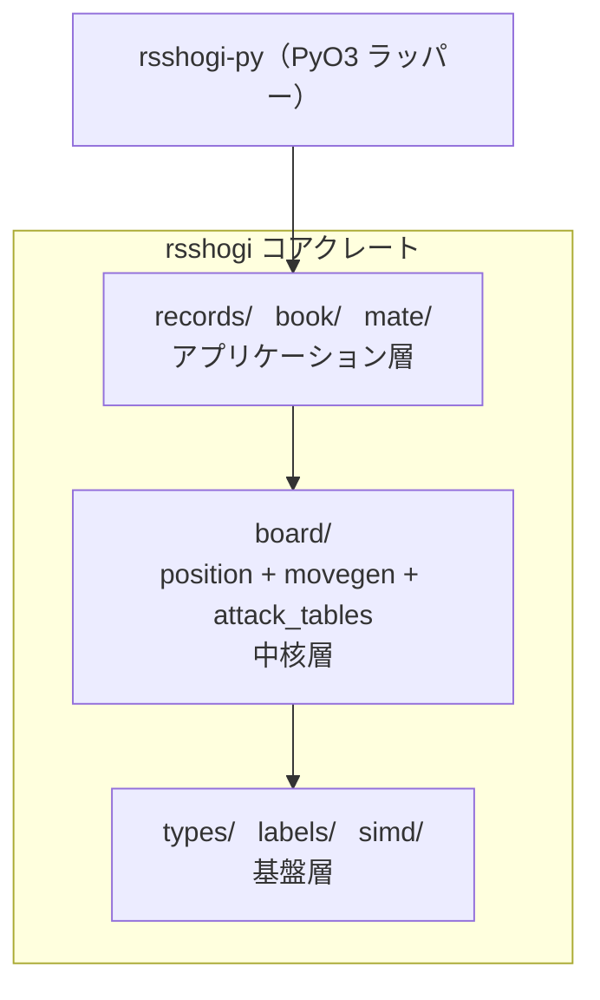

# 全体アーキテクチャ

`rsshogi` は、Rust のコアクレートと PyO3 による Python バインディングクレートで構成する Cargo workspace です。

## クレート構成

| クレート | パス | 役割 |
|---------|------|------|
| `rsshogi` | `crates/rsshogi/` | 盤面表現、合法手生成、棋譜処理などのコア機能。 |
| `rsshogi-py` | `crates/rsshogi-py/` | PyO3 による Python バインディング。 |

`rsshogi-py` は workspace 内のクレート名です。
Python では `rsshogi` または `rsshogi-avx2` をインストールし、どちらも `rsshogi` として import します。

## rsshogi コアクレートのモジュール構成

```text
rsshogi/src/
├── types/       基本型（Color, Square, Piece, Move, Move32, Bitboard, Hand）
├── labels/      policy label の変換
├── board/       局面管理、合法性判定、指し手生成
│   ├── position/      局面の保持、更新、合法性判定、Zobrist ハッシュ
│   ├── movegen/       駒種別の指し手生成（盤上移動、駒打ち、王手回避）
│   ├── attack_tables/ 利きテーブルと飛び利き
│   ├── state_info/    差分更新で持ち回る局面のメタ情報
│   └── ...            BitboardSet、MoveList、perft、lookup
├── records/     KIF、KI2、CSA、JKF、PACK、SBINPACK、SAZ2
├── book/        MemoryBook、StaticBook、DB2016、YBB、SBK
├── mate/        合法手に基づく一手詰め判定
└── simd/        crate 内部の SIMD primitive
```

## レイヤー構造

モジュール間の依存は以下のように下から上へ積み上がっています。



- **基盤層**：`types`、`labels`、`simd` が基本型、局面に依存しないラベル変換、内部 SIMD primitive を提供します。
- **中核層**：`board` が局面管理、指し手生成、利き計算を統合します。
- **機能層**：`records`、`book`、`mate` が棋譜、定跡、一手詰めを提供します。

`labels/` は `Move` と手番を full label または compact label に変換します。
局面の保存形式から独立した変換なので、Rust、Python、学習ツールで同じ対応を利用できます。

## 設計方針

- **再利用可能なコア**：局面、合法手、基本型を、棋譜や定跡の依存なしで利用できます。
- **形式ごとの feature**：`records`、`book`、`position-serialization`、`policy-labels` などを用途に合わせて追加します。
- **薄い Python バインディング**：規則と形式の処理は Rust 側に置き、Python から同じ意味論を利用できます。
- **探索との分離**：評価関数と探索本体は含めず、探索エンジンが使う局面操作と手生成を提供します。
- **境界の互換性**：公開 raw 値と HCP、PackedSfen、PACK、YBB、SBK などのワイヤ形式をテストで固定します。

## 詳細

各モジュールの内部実装については [内部技術ドキュメント](internals/index.md) を参照してください。
Rust API の詳細は [docs.rs](https://docs.rs/rsshogi) で閲覧できます。
