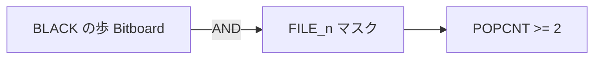
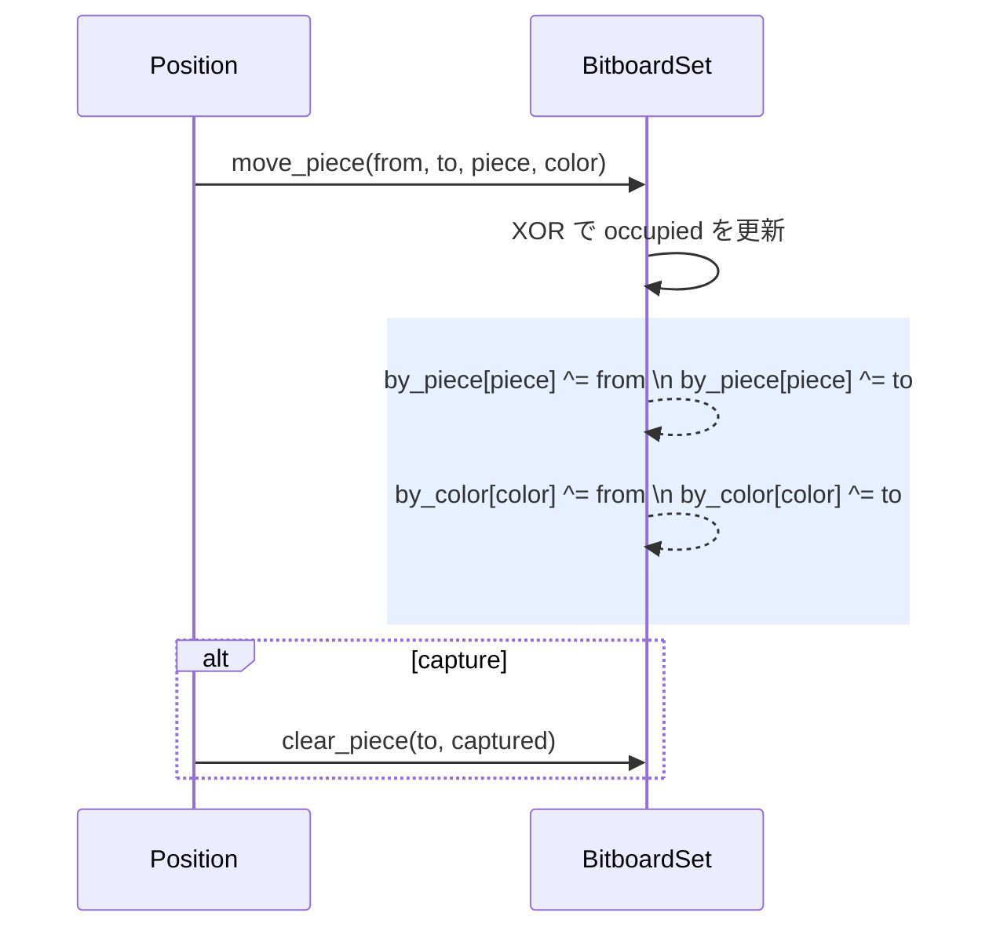

# 基本操作

> **前提知識**: [レイアウト](./layout.md)（ビット順序と128ビット表現）

## このページの要点

- `Bitboard::file_mask(file)` / `Bitboard::rank_mask(rank)`（内部テーブル `FILE_MASKS` / `RANK_MASKS`）は筋・段のマスクで、駒の配置フィルタや移動制約に使う
- `between(a, b)` は 2 マス間の経路、`line(a, b)` は直線全体を返す（合駒・ピン判定の基盤）
- `pop_lsb()` は最下位ビットを取り出して除去し、O(駒数) の列挙を実現する
- 差分更新は XOR ベースで分岐なし（`move_piece()` が `by_piece` と `by_color` を同時更新）

このページでは、Bitboard の基本的なビット演算、マスク、シフト、列挙ユーティリティをまとめます。
筋・段マスク（`file_mask` / `rank_mask`）や `between/line` などの基礎 API の使いどころも記載します。

## between/line の可視化
以下は 5五の王、5二の敵飛車、間に 5三の自駒がある例です。
`between(5五,5二)` は 5三と 5四 を含む直線集合になります。
`line(5五,5二)` は 5筋の直線全体です。

赤い矢印が飛車の利き方向、緑のハイライトが `between` の範囲（合駒可能マス）、青い丸が玉の位置を示しています。

<div id="ops-live-1" style="width:640px;height:720px;margin:1rem auto;border:1px solid #ddd;"></div>
<script src="../../assets/shogi-board.js"></script>
<script>
{
  const { ShogiBoardAdapter } = RShogiBoard.installShogiBoardGlobals(window);
  const root = document.getElementById('ops-live-1');
  const board = new ShogiBoardAdapter();
  board.mount(root);
  board.setOptions({ showHands: false });
  // 5五に先手玉、5三に先手銀、5二に後手飛。
  board.setPositionFromSFEN('9/4r4/4S4/9/4K4/9/9/9/9 b - 1');
  board.goTo(0);
  // 飛車から王への利き方向
  board.setArrows([
    { from: '5b', to: '5e', color: 'rgba(220,50,50,0.7)', width: 1.5 },
  ]);
  // between(5五, 5二) = {5三, 5四} をハイライト
  board.highlightSquares([
    4 * 9 + 2,  // 5三
    4 * 9 + 3,  // 5四
  ]);
  // 玉の位置に丸
  board.setCircles([
    { square: '5e', color: 'rgba(0,120,215,0.8)', width: 2.0 },
    { square: '5b', color: 'rgba(220,50,50,0.6)', width: 1.5 },
  ]);
  window.opsLive1 = board;
}
</script>

```rust,ignore
// 合駒判定: 王と王手駒の間に駒を打てるか？
let evasion_targets = between(king_sq, checker_sq) | checker_sq.to_bb();
```

## ビットマスクとシフト演算

縦型ビットボードでは、段ごとに `<< 1` / `>> 1` で前後へ移動し、筋方向は `<< 9` / `>> 9` で表現します。

**基本パターン**:
- 筋マスク: `0b100000000` をシフトして生成。
- 段マスク: `0b111111111` を左シフト。
- 利きの合成: `attacks |= mask` (OR)。
- 遮蔽駒検出: `blocked = attacks & occupied` (AND)。
- 自駒除外: `moves = attacks & !self_pieces` (AND NOT)。

## 実例: 先手の歩を抽出

[Bitboard の概要](./index.md#集合演算--and-でフィルタ) では「集合の交差」として AND を見ました。
同じ題材を、`Bitboards` が保持する 2 つの中間集合から実際に `black_pawns` を作る手順として見ます。

対象局面には、後手歩が 3三・7三、先手歩が 3七・7七、先手銀が 3九・7九、先手玉が 5九にあります。
この局面から「歩であるマス」と「先手駒であるマス」を別々に取り出し、最後に AND で共通部分だけを残します。

<div id="bb-examples-extract-flow" style="display:grid;grid-template-columns:repeat(4,minmax(0,1fr));gap:0.75rem;margin:1rem auto;max-width:1120px;">
  <div>
    <p style="text-align:center;margin:0 0 0.35rem;">position</p>
    <div id="bb-examples-position" style="width:100%;height:340px;border:1px solid #ddd;"></div>
  </div>
  <div>
    <p style="text-align:center;margin:0 0 0.35rem;">by_piece[PAWN]</p>
    <div id="bb-examples-pawn-all" style="width:100%;height:340px;border:1px solid #ddd;"></div>
  </div>
  <div>
    <p style="text-align:center;margin:0 0 0.35rem;">by_color[BLACK]</p>
    <div id="bb-examples-black-all" style="width:100%;height:340px;border:1px solid #ddd;"></div>
  </div>
  <div>
    <p style="text-align:center;margin:0 0 0.35rem;">AND result</p>
    <div id="bb-examples-black-pawn-result" style="width:100%;height:340px;border:1px solid #ddd;"></div>
  </div>
</div>
<script src="../../assets/shogi-board.js"></script>
<script>
{
  const { ShogiBoardAdapter } = RShogiBoard.installShogiBoardGlobals(window);
  const sfen = '9/9/2p3p2/9/9/9/2P3P2/9/2S1K1S2 b - 1';
  const square = (file, rank) => (file - 1) * 9 + (rank - 1);
  const pawns = [
    square(3, 3), square(7, 3),
    square(3, 7), square(7, 7),
  ];
  const blackPieces = [
    square(3, 7), square(7, 7),
    square(3, 9), square(5, 9), square(7, 9),
  ];
  const blackPawns = [
    square(3, 7), square(7, 7),
  ];
  const boards = [
    ['bb-examples-position', []],
    ['bb-examples-pawn-all', pawns],
    ['bb-examples-black-all', blackPieces],
    ['bb-examples-black-pawn-result', blackPawns],
  ];
  for (const [id, highlights] of boards) {
    const root = document.getElementById(id);
    const board = new ShogiBoardAdapter();
    board.mount(root);
    board.setOptions({ showHands: false });
    board.setPositionFromSFEN(sfen);
    board.highlightSquares(highlights);
    board.goTo(0);
    window[id.replace(/-/g, '_')] = board;
  }
}
</script>

`by_piece[PAWN]` は先後を見ずにすべての歩を含みます。`by_color[BLACK]` は駒種を見ずに先手駒をすべて含みます。
そのため、`by_piece[PAWN] & by_color[BLACK]` の結果には、両方の条件を満たす 3七・7七だけが残ります。

```rust,ignore
let black_pawns = bitboards.by_piece[PAWN] & bitboards.by_color[BLACK];
```

配列ベースなら 81 マスを走査して「駒種が歩か」「色が先手か」を毎回判定します。
Bitboard では、すでに更新済みの集合同士を AND するだけなので、この抽出は 1 つのビット演算になります。


### なぜ高速なのか
列ごとのテーブル参照や 90° / 45° 回転もビット演算のテクニックで済み、条件分岐をほとんど伴いません。[^cpw-board-definition]
探索木を展開するときは毎手局面を更新しますが、ビット演算の連鎖だけで局面差分を適用できるため、64 ビットレジスタを備えた CPU では高効率です。

rsshogi では [SSE2](../simd/instructions.md#sse2-128-ビット整数論理演算) の `__m128i` を利用し、128 ビット幅の AND/OR/XOR を 1 命令で実行します。
`[u64; 2]` を個別に演算する場合の 2 命令が 1 命令に集約されるため、ビットボード演算全体のスループットが向上します。

## 筋マスク・段マスク（FILE_MASKS / RANK_MASKS）

筋（FILE）と段（RANK）のマスクは事前計算された内部テーブル `FILE_MASKS` / `RANK_MASKS` として保持され、
公開 API の `Bitboard::file_mask(file)` / `Bitboard::rank_mask(rank)` 経由で取得します。

```rust,ignore
{{#include ../../../../../crates/rsshogi/src/types/bitboard.rs:bitboard_file_rank_masks}}
```
<small>[ソースコード](https://github.com/nyoki-mtl/rsshogi/blob/main/crates/rsshogi/src/types/bitboard.rs#L83-L106)</small>

使用例:

```rust,ignore
// 使用例: 5筋の全駒を抽出
let file5_pieces = occupied & Bitboard::file_mask(File::FILE_5);

// 香の利き計算で遮蔽駒を筋内で検出
let file_occupied = occupied & Bitboard::file_mask(square.file());
let beams = LANCE_BEAMS[square.to_index()];
let blockers = file_occupied & if color == Color::BLACK { beams.black } else { beams.white };

// 端マスクによる盤外チェック
let edge_mask = Bitboard::file_mask(File::FILE_1)
    | Bitboard::file_mask(File::FILE_9)
    | Bitboard::rank_mask(Rank::RANK_1)
    | Bitboard::rank_mask(Rank::RANK_9);
if (attacks & edge_mask).any() {
    // 端に到達している
}
```

## シフト演算による移動

将棋の駒の移動は定数シフトで表現できます。[^psilord-rep]
縦型レイアウトでは、段方向が ±1、筋方向が ±9 です。

### 金の移動方向

5五の金から 6 方向への移動をシフト演算で表現します。
各矢印がシフト演算に対応しています。

<div id="ops-gold-shift" style="width:600px;height:660px;margin:1rem auto;border:1px solid #ddd;"></div>
<script src="../../assets/shogi-board.js"></script>
<script>
{
  const { ShogiBoardAdapter } = RShogiBoard.installShogiBoardGlobals(window);
  const root = document.getElementById('ops-gold-shift');
  const board = new ShogiBoardAdapter();
  board.mount(root);
  board.setOptions({ showHands: false });
  board.setPositionFromSFEN('9/9/9/9/4G4/9/9/9/9 b - 1');
  board.goTo(0);
  // 金の6方向の利き
  board.setArrows([
    { from: '5e', to: '5d', color: 'rgba(0,120,215,0.6)' },   // >> 1（前）
    { from: '5e', to: '5f', color: 'rgba(0,120,215,0.6)' },   // << 1（後）
    { from: '5e', to: '4e', color: 'rgba(0,180,0,0.6)' },     // >> 9（右）
    { from: '5e', to: '6e', color: 'rgba(0,180,0,0.6)' },     // << 9（左）
    { from: '5e', to: '4d', color: 'rgba(255,140,0,0.6)' },   // >> 10（右前）
    { from: '5e', to: '6d', color: 'rgba(255,140,0,0.6)' },   // << 8（左前）
  ]);
  board.setCircles([
    { square: '5e', color: 'rgba(0,120,215,0.5)' },
  ]);
  window.opsGoldShift = board;
}
</script>

| 方向 | シフト | 演算 | 色 |
|------|--------|------|-----|
| 前（上） | -1 | `bb >> 1` | 🔵 青 |
| 後（下） | +1 | `bb << 1` | 🔵 青 |
| 右 | -9 | `bb >> 9` | 🟢 緑 |
| 左 | +9 | `bb << 9` | 🟢 緑 |
| 右前 | -10 | `bb >> 10` | 🟠 オレンジ |
| 左前 | +8 | `bb << 8` | 🟠 オレンジ |

```rust,ignore
// 段方向の移動（縦型レイアウトでは +1/-1）
let forward_one = bitboard >> 1;   // 黒番の前進
let backward_one = bitboard << 1;  // 黒番の後退

// 筋方向の移動（9マスずつ）
let right_file = bitboard >> 9;    // 右の筋へ
let left_file = bitboard << 9;     // 左の筋へ

// 斜め移動（桂馬、角）
let knight_move = (bitboard >> 10) | (bitboard << 8);  // 桂馬の移動候補
let bishop_ne = bitboard >> 10;  // 北東（右上）
let bishop_sw = bitboard << 10;  // 南西（左下）
```

注意点:
- 端マスからのシフトは盤外へ溢れるため、マスク処理が必要。
- 事前計算した移動パターン（`*_step_attacks` などの利きテーブル）で盤外チェック済みのパターンを保持。

## ビット操作の実践テクニック

以下は Bitboard 処理で頻出するビット操作パターンです。

```rust,ignore
// 1. LSB 分離（最下位ビットのみ抽出）
let lsb = bitboard & (!bitboard + 1);
// または標準ライブラリで: bitboard.trailing_zeros()

// 2. LSB リセット（最下位ビットを除去）
bitboard &= bitboard - 1;
// rsshogi では pop_lsb() で実装

// 3. MSB 分離（最上位ビットのみ抽出）
let msb = 1u128 << bitboard.leading_zeros();

// 4. ビット反転（補集合）
let empty_squares = !occupied & Bitboard::ALL_SQUARES;

// 5. ビット数カウント（POPCNT）
//    x86-64 では POPCNT 命令で 1 サイクル実行
//    (詳細は SIMD 拡張命令リファレンスの POPCNT の節を参照)
let piece_count = bitboard.count(); // rsshogi のメソッド名は count()
```

> **SIMD との関連**: `pop_lsb()` は内部で [TZCNT](../simd/instructions.md#bmi1-tzcnt--lzcnt--andn)（BMI1）を、`count()` は [POPCNT](../simd/instructions.md#popcnt-ビットカウント) を使用します。
> いずれも x86-64 の多くの CPU で 1 サイクルで実行でき、ビットボードの列挙・カウント性能の基盤です。

### `pop_lsb` の実装

`pop_lsb` はビットボードの心臓部です。
最下位の立っているビットを取り出して除去し、セットされたビットだけを O(駒数) で列挙します。[^healeycodes-viz]

#### pop_lsb のステップ実行

以下のアニメーションは、3枚の先手歩から `pop_lsb` で1枚ずつ取り出す過程を示します。
丸が現在取り出されるビット（最下位）です。

<div id="ops-poplsb-demo" style="width:600px;height:660px;margin:1rem auto;border:1px solid #ddd;"></div>
<script src="../../assets/shogi-board.js"></script>
<script>
{
  const { ShogiBoardAdapter } = RShogiBoard.installShogiBoardGlobals(window);
  const root = document.getElementById('ops-poplsb-demo');
  const board = new ShogiBoardAdapter();
  board.mount(root);
  board.setOptions({ showHands: false });
  // 3枚の歩: 2七、5七、8七
  board.animate([
    {
      sfen: '9/9/9/9/9/9/1P2P2P1/9/9 b - 1',
      circles: [
        { square: '2g', color: 'rgba(0,180,0,0.8)', width: 2.0 },
      ],
      arrows: [
        { from: '2g', to: '2f', color: 'rgba(0,120,215,0.5)' },
      ],
      duration: 2000,
    },
    {
      sfen: '9/9/9/9/9/9/4P2P1/9/9 b - 1',
      circles: [
        { square: '5g', color: 'rgba(0,180,0,0.8)', width: 2.0 },
      ],
      arrows: [
        { from: '5g', to: '5f', color: 'rgba(0,120,215,0.5)' },
      ],
      duration: 2000,
    },
    {
      sfen: '9/9/9/9/9/9/7P1/9/9 b - 1',
      circles: [
        { square: '8g', color: 'rgba(0,180,0,0.8)', width: 2.0 },
      ],
      arrows: [
        { from: '8g', to: '8f', color: 'rgba(0,120,215,0.5)' },
      ],
      duration: 2000,
    },
    {
      sfen: '9/9/9/9/9/9/9/9/9 b - 1',
      duration: 1500,
    },
  ], { loop: true, autoPlay: true });
  window.opsPopLsbDemo = board;
}
</script>

```rust,ignore
{{#include ../../../../../crates/rsshogi/src/types/bitboard.rs:bitboard_pop_lsb}}
```
<small>[ソースコード](https://github.com/nyoki-mtl/rsshogi/blob/main/crates/rsshogi/src/types/bitboard.rs#L385-L405)</small>

### `count` の実装

```rust,ignore
{{#include ../../../../../crates/rsshogi/src/types/bitboard.rs:bitboard_count}}
```
<small>[ソースコード](https://github.com/nyoki-mtl/rsshogi/blob/main/crates/rsshogi/src/types/bitboard.rs#L441-L449)</small>

### 具体的な操作例

以下の例はビット演算と `Bitboard` API の利用方法を示します。

```rust,ignore
use rsshogi::board::bitboard::Bitboard;
use rsshogi::types::{Square, SQ_55, SQ_56};

// 単一のマスからビットボードを生成
let pawn = Bitboard::from_square(SQ_55);
let destination = Bitboard::from_square(SQ_56);

// 占有ビットボードと目的地の交差判定
if pawn & destination != Bitboard::EMPTY {
    // 目的地に駒がいるため移動不可
    panic!("Square already occupied!");
}

// 歩の移動候補を合成（和集合）
let attack_mask = pawn | destination;

// Bitboard をループ処理
for sq in attack_mask {
    println!("reachable square: {:?}", sq);
    // 出力例: reachable square: Square(44)
    //         reachable square: Square(45)
}
```

**ポイント**:
- `&` (AND): 交差判定。
- `|` (OR): 和集合。
- `Bitboard::EMPTY`: 空のビットボード（全ビット 0）。
- `for sq in bitboard`: Iterator トレイトで直接ループ可能。

差分更新での XOR パターン:

```rust,ignore
// 移動元と移動先を同時更新
piece_bb ^= Bitboard::from_square(from) | Bitboard::from_square(to);

// 先後同時更新（持ち駒で使用）
hand_bb ^= (1 << black_index) | (1 << white_index);
```

## 飛車と遮蔽駒の例

5五の飛車の左に味方の歩がある局面です。
飛車の利きが味方駒で遮られ、左方向が制限されています。
青い矢印が通過可能な利き、赤い丸が遮蔽駒の位置です。

<div id="bb-examples-live-1" style="width:640px;height:720px;margin:1rem auto;border:1px solid #ddd;"></div>
<script src="../../assets/shogi-board.js"></script>
<script>
{
  const { ShogiBoardAdapter } = RShogiBoard.installShogiBoardGlobals(window);
  const root = document.getElementById('bb-examples-live-1');
  const board = new ShogiBoardAdapter();
  board.mount(root);
  board.setOptions({ showHands: false });
  // 5五に先手飛、6五に先手歩。
  board.setPositionFromSFEN('9/9/9/9/3PR4/9/9/9/9 b - 1');
  board.goTo(0);
  // 飛車の利き方向を矢印で表示
  board.setArrows([
    { from: '5e', to: '5a', color: 'rgba(0,120,215,0.6)', width: 1.2 },  // 上方向（全通）
    { from: '5e', to: '5i', color: 'rgba(0,120,215,0.6)', width: 1.2 },  // 下方向（全通）
    { from: '5e', to: '1e', color: 'rgba(0,120,215,0.6)', width: 1.2 },  // 右方向（全通）
    { from: '5e', to: '6e', color: 'rgba(220,50,50,0.4)', width: 0.8 },  // 左方向（遮断）
  ]);
  // 遮蔽駒（味方歩）に赤丸
  board.setCircles([
    { square: '6e', color: 'rgba(220,50,50,0.7)', width: 1.5 },
  ]);
  window.bbExamples1 = board;
}
</script>

```rust,ignore
// 飛車の利き（遮蔽駒考慮）
let attacks = rook_attacks(SQ_55, occupied);
// 味方駒で利きをフィルタ
let legal_targets = attacks & !our_pieces;
```

## between/line の基礎ユーティリティ

王手回避などで用いる、2 マス間の経路マスクの例です。

```rust,ignore
// 回避可能マスク: 王と利き駒の間 + その駒
let evasion_targets = between(king, checker) | checker;  // 2 命令

// 二歩判定（筋マスク + POPCNT）
let has_double_pawn = (pawns & file_mask).count() >= 2;  // 3 命令
```

実装は盤レイアウトとシフト規則に依存するため、`bitboard/sliders` 節の設計と整合させてください。

### between と line の実装概略

以下は縦型 9×9 かつ `u128` 前提の概略です。
境界処理と盤外マスクは省略しています。

```rust,ignore
/// 2 つのマスの間にあるビット集合を返す（端点は含まない）。
/// 直線上にない場合は空集合。
pub fn between(a: Square, b: Square) -> Bitboard {
    // 同筋（file が同じ）
    if a.file() == b.file() {
        let (lo, hi) = (a.min(b), a.max(b));
        return Bitboard::file_mask(a.file()) & Bitboard::range_exclusive(lo, hi);
    }
    // 同段（rank が同じ）
    if a.rank() == b.rank() {
        let (lo, hi) = (a.min(b), a.max(b));
        return Bitboard::rank_mask(a.rank()) & Bitboard::range_exclusive(lo, hi);
    }
    // 斜め（|Δfile| == |Δrank|）
    if (a.file() as i32 - b.file() as i32).abs() == (a.rank() as i32 - b.rank() as i32).abs() {
        let diag_mask = Bitboard::diag_mask_through(a) & Bitboard::diag_mask_through(b);
        let (lo, hi) = (a.min(b), a.max(b));
        return diag_mask & Bitboard::range_exclusive(lo, hi);
    }
    Bitboard::EMPTY
}

/// a と b を含む直線上の全ビット。
pub fn line(a: Square, b: Square) -> Bitboard {
    if a.file() == b.file() {
        return Bitboard::file_mask(a.file());
    }
    if a.rank() == b.rank() {
        return Bitboard::rank_mask(a.rank());
    }
    if (a.file() as i32 - b.file() as i32).abs() == (a.rank() as i32 - b.rank() as i32).abs() {
        return Bitboard::diag_mask_through(a) & Bitboard::diag_mask_through(b);
    }
    Bitboard::EMPTY
}
```

実装時の注意:
- `range_exclusive(lo, hi)` は `lo` と `hi` の間だけを 1 にするヘルパです。
- 斜め用の `diag_mask_through` は主対角線と副対角線を分けて計算します。
- 盤外を含む生成は最後に `ALL_SQUARES` と AND して落とします。

## 例: 二歩判定（同一筋に 2 枚の歩）

筋マスクと POPCNT を組み合わせると、二歩を高速に検出できます。

```rust,ignore
let file_mask = Bitboard::file_mask(square.file());
let black_pawns_on_file = bitboards.by_piece[PAWN] & bitboards.by_color[BLACK] & file_mask;
let has_double_pawn = black_pawns_on_file.count() >= 2;
```

Mermaid でのイメージ:



## 差分更新の流れ

`BitboardSet` は `set_piece()` / `clear_piece()` / `move_piece()` を通じて XOR ベースの更新を実行します。

### `BitboardSet` の構造体定義

```rust,ignore
{{#include ../../../../../crates/rsshogi/src/board/bitboard_set.rs:bitboard_set_struct}}
```
<small>[ソースコード](https://github.com/nyoki-mtl/rsshogi/blob/main/crates/rsshogi/src/board/bitboard_set.rs#L10-L23)</small>

### `move_piece` の実装

```rust,ignore
{{#include ../../../../../crates/rsshogi/src/board/bitboard_set.rs:bitboard_set_move_piece}}
```
<small>[ソースコード](https://github.com/nyoki-mtl/rsshogi/blob/main/crates/rsshogi/src/board/bitboard_set.rs#L46-L60)</small>

使用例:

```rust,ignore
// 駒を移動させる差分更新の例
let mut bitboards = BitboardSet::new();
let from = Square::SQ_55;
let to = Square::SQ_56;
let piece = PieceType::PAWN;
let color = Color::BLACK;

bitboards.move_piece(from, to, piece, color);

// 成りや取りがある場合の差分
if let Some(captured) = maybe_capture {
    bitboards.clear_piece(
        to,
        captured.piece_type(),
        captured.color()
    );
}
```

**差分更新の利点**:
- XOR 演算のみで完結（分岐なし）。
- Occupancy も自動的に同期。
- 評価関数の差分更新と統合可能。



---

## 落とし穴

### `between` の端点包含に注意

`between(a, b)` は `a` と `b` の**間**のマスのみを返し、`a` と `b` 自身は含みません。
合駒判定では `between` の結果を使いますが、王手駒を取る手には `between` ではなく別途 `checker_sq` を対象に含める必要があります。
一方、`line(a, b)` は直線全体（`a` と `b` を含む）を返します。

### `pop_lsb()` と `pop_lsb_unchecked()` の使い分け

`pop_lsb()` は `Option<Square>` を返し、空の Bitboard では `None` を返すため安全です。
ループは `while let Some(sq) = bb.pop_lsb() { ... }` と書くのが基本パターンです。

一方、`unsafe fn pop_lsb_unchecked()` は空でないことを呼び出し側が保証する前提の高速版で、
空の Bitboard に対して呼ぶと未定義動作になります。空チェックを省ける確証がある場合にのみ使ってください。

### シフト演算の盤外溢れ

`bitboard << 1`（段方向シフト）を 9 段目のマスに適用すると、隣の筋の 1 段目にビットが移動します。
端マスでのシフトは必ず `& Bitboard::file_mask(file)` や `& Bitboard::rank_mask(rank)` でマスクしてから行ってください。

## まとめ

- `file_mask` / `rank_mask`（内部テーブル `FILE_MASKS` / `RANK_MASKS`）は筋・段フィルタの基本部品
- `between` / `line` は合駒・ピン判定のコア（端点の包含に注意）
- `pop_lsb()` による O(駒数) 列挙が Bitboard の高速性の鍵
- 差分更新は XOR のみで分岐なし、評価関数との統合も容易

## 次に読む

→ **[利きの計算](./attacks.md)**: ステップ駒・遠方駒の利き生成アルゴリズムに進みます。

---

[^cpw-board-definition]: ChessProgramming Wiki, ["Bitboard Board-Definition"](https://www.chessprogramming.org/Bitboard_Board-Definition)
[^healeycodes-viz]: healeycodes, ["Visualizing Chess Bitboards"](https://healeycodes.com/visualizing-chess-bitboards) — ビットボードの視覚化と列挙テクニック
[^psilord-rep]: psilord, ["Representation of a Chess Board with a Bitboard"](https://pages.cs.wisc.edu/~psilord/blog/data/chess-pages/rep.html) — ビットボードの基本構造
