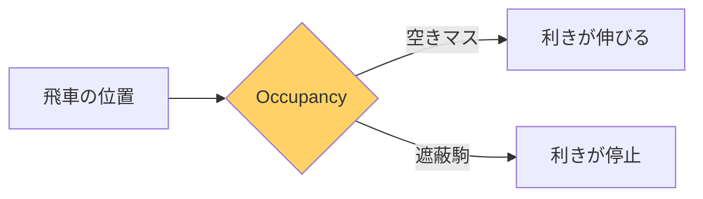
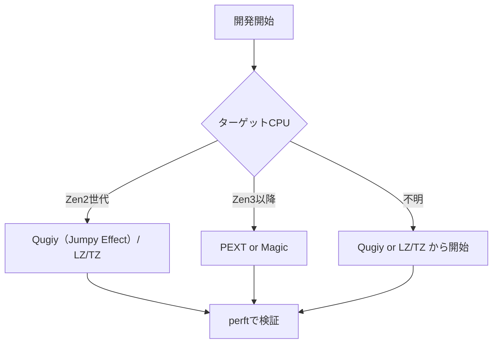
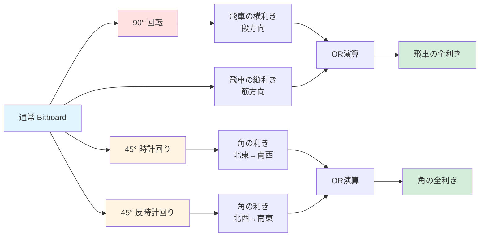
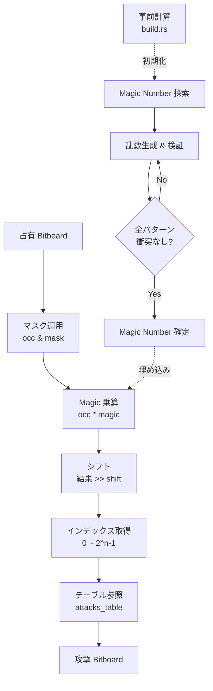

# 飛び利きアルゴリズム比較

> **前提知識**: [利きの計算](./attacks.md)（ステップ駒と遠方駒の利き生成の基礎）

## このページの要点

- 飛び利き計算の難しさは「Occupancy 依存」：途中の駒の有無で利きが動的に変わる
- 主要 5 手法: **Rotated**, **Magic**, **PEXT（BMI2）**, **LZ/TZ**, **Jumpy Effect（Qugiy）**（速度・移植性・実装量にトレードオフ）
- rsshogi は **Qugiy 方式（差分抽出＋byte_reverse）** を採用: CPU 依存が小さく、Zen2 含む多様な環境で安定して高速
- **推奨環境サマリー**: Intel Haswell+ → PEXT も選択肢、AMD Zen2 → Qugiy or Magic が安全、汎用 → Qugiy or LZ/TZ

香・角・飛車のような遠方駒は途中の駒（Occupancy）の状態で利きが変わります。[^antenna-bitboard]
主要アルゴリズムと将棋特有の判断ポイントを整理し、各手法を概要と詳細で一覧します。

## なぜ飛び利きの計算が難しいか

### 1. Occupancy 依存性
ステップ駒（金・銀・桂等）は周囲の固定パターンで攻撃範囲が決まりますが、遠方駒は盤面状態に依存します。

> **関連**: 遠方駒の利き管理を効率化する Long Effect Library という手法もあります。
> 利き数カウントや一手詰め判定を高速化する高度な技術で、やねうら王で開発されました。
> rsshogi では採用しない設計判断を下しており、利き数カウント等が必要な場合は探索エンジン側で実装してください。



**例: 5五の飛車**
```text
空盤面:        遮蔽あり:
□□■□□        □□■□□
□□■□□        □□■□□
■■飛■■   vs   □□飛■□  (6五に味方駒)
□□■□□        □□■□□
□□■□□        □□□□□
```

この違いを高速に計算するのが飛び利きアルゴリズムの課題です。[^healeycodes-viz] [^ptidej-bitboard]

### 2. 方向ごとの遮蔽駒検出
飛車は 4 方向、角は 4 方向、香は 1 方向を調べる必要があります。

### 遮蔽駒で変わる利き

アニメーションで、**遮蔽駒の有無**で攻撃集合がどう変わるかを比較します。
同じ5五の飛車でも、6五に味方歩を置くだけで左方向の利きが激変します。

<div id="sliders-live-1" style="width:640px;height:720px;margin:1rem auto;border:1px solid #ddd;"></div>
<script src="../../assets/shogi-board.js"></script>
<script>
{
  const { ShogiBoardAdapter } = RShogiBoard.installShogiBoardGlobals(window);
  const root = document.getElementById('sliders-live-1');
  const board = new ShogiBoardAdapter();
  board.mount(root);
  board.setOptions({ showHands: false });
  board.animate([
    // Frame 1: 遮蔽駒なし（全方向到達）
    {
      sfen: '9/9/9/9/4R4/9/9/9/9 b - 1',
      arrows: [
        { from: '5e', to: '5a', color: 'rgba(0,120,215,0.7)', width: 1.2 },
        { from: '5e', to: '5i', color: 'rgba(0,120,215,0.7)', width: 1.2 },
        { from: '5e', to: '1e', color: 'rgba(0,120,215,0.7)', width: 1.2 },
        { from: '5e', to: '9e', color: 'rgba(0,120,215,0.7)', width: 1.2 },
      ],
      duration: 3000,
    },
    // Frame 2: 6五に味方歩（左方向が制限）
    {
      sfen: '9/9/9/9/3PR4/9/9/9/9 b - 1',
      arrows: [
        { from: '5e', to: '5a', color: 'rgba(0,120,215,0.7)', width: 1.2 },
        { from: '5e', to: '5i', color: 'rgba(0,120,215,0.7)', width: 1.2 },
        { from: '5e', to: '1e', color: 'rgba(0,120,215,0.7)', width: 1.2 },
        { from: '5e', to: '6e', color: 'rgba(220,50,50,0.5)', width: 0.8 },
      ],
      circles: [
        { square: '6e', color: 'rgba(220,50,50,0.8)', width: 2.0 },
      ],
      duration: 3000,
    },
    // Frame 3: さらに3五にも敵歩（右も制限）
    {
      sfen: '9/9/9/9/3PR1p2/9/9/9/9 b - 1',
      arrows: [
        { from: '5e', to: '5a', color: 'rgba(0,120,215,0.7)', width: 1.2 },
        { from: '5e', to: '5i', color: 'rgba(0,120,215,0.7)', width: 1.2 },
        { from: '5e', to: '3e', color: 'rgba(0,180,0,0.7)', width: 1.2 },
        { from: '5e', to: '6e', color: 'rgba(220,50,50,0.5)', width: 0.8 },
      ],
      circles: [
        { square: '6e', color: 'rgba(220,50,50,0.7)', width: 1.5 },
        { square: '3e', color: 'rgba(0,180,0,0.7)', width: 1.5 },
      ],
      duration: 3000,
    },
  ], { loop: true, autoPlay: true });
  window.slidersLive1 = board;
}
</script>

- **Frame 1**: 空盤面 → 4方向全てが盤端まで到達
- **Frame 2**: 6五に味方歩 → 左方向が 🔴 遮断（味方駒は取れないため利き範囲外）
- **Frame 3**: 3五に敵歩も追加 → 右方向が 🟢 敵駒まで到達（取る手は合法）

これが「Occupancy 依存」の本質です。
同じマスからでも、盤面状態によって結果が全く異なります。[^jwatzman-magic]

**素朴な実装の問題点**:
```rust,ignore
// 配列ベース: 各方向をループで探索
for dir in [N, S, E, W] {
    let mut sq = from;
    loop {
        sq = sq.step(dir);
        if !sq.is_valid() { break; }      // 盤外判定
        attacks.insert(sq);
        if occupied.contains(sq) { break; } // 遮蔽駒判定
    }
}
```
- 最大 14 マス×4 方向 = 56 回のループ
- 各ステップで盤外チェックと遮蔽駒チェックが必要
- 分岐予測ミスが頻発

## アルゴリズムの分類

ChessProgramming Wiki では以下の 2 系統に分類されます：[^cpw-sliding]

### 計算ベース
- テーブルを使わず、ビット演算で都度計算
- 例: Hyperbola Quintessence, Obstruction Difference
- メモリは少ないが命令数が多い

### Occupancy 参照
- 事前計算したテーブルを参照
- 例: Rotated, Magic, PEXT, LZ/TZ
- 高速だが初期化とメモリが必要

---

## rsshogi の選択: Qugiy 方式（差分抽出＋byte_reverse）

rsshogi は **Qugiy 方式（Jumpy Effect）** を採用しています。
減算の借位伝播と `byte_reverse` を組み合わせ、事前テーブルなしで遠方駒の利きを O(1) で算出する方式です。
角には `Bitboard256`（[AVX2](../simd/instructions.md#avx2-256-ビット整数演算) の `__m256i`）で 4 方向並列処理を適用しています。
CPU 依存性が小さく、[AMD Zen2 の PEXT 問題](../simd/history.md#amd-の-bmi2pextpdep問題)を回避しつつ多様な環境で安定して高速です。
Magic Bitboard のようなテーブル探索が不要で、実装が簡潔な点も採用理由です。[^nereuxofficial-rust]

詳細な実装解説は [利きの計算](./attacks.md#rsshogi-の選択-qugiy-方式差分抽出byte_reverse) を参照してください。

---

## ISA と手法のサマリ

以下は代表的な ISA/CPU ごとの有利な手法の概観です。
実際の最適解は実装や周辺最適化に依存するため、ベンチで確認してください。

| 環境/ISA | 推奨手法 | コメント |
|---|---|---|
| Intel Haswell 以降（[BMI2](../simd/instructions.md#bmi2-pext--pdep)） | PEXT | 3 サイクル前後で高速。|
| Intel [AVX2](../simd/instructions.md#avx2-256-ビット整数演算)/AVX-512 | Qugiy + SIMD 併用 | PEXT 併用可。角の 4 方向並列に AVX2 を使用。|
| AMD Zen2 | Qugiy または Magic | [PEXT がマイクロコード実装で遅い](../simd/history.md#amd-の-bmi2pextpdep問題)。**rsshogi の選択**。|
| AMD Zen3/Zen4（BMI2） | PEXT | Zen2 比で大幅改善（ハードウェア実装）。|
| 非 BMI2 環境 | Qugiy, LZ/TZ, または Magic | [機能検出](../simd/instructions.md#実行時の機能検出)で安全にフォールバック。|

注記: Rotated は教育的価値が高いものの、更新コストと 9×9 のテーブル膨張で近年の採用は減少傾向です。

## 手法の総合比較

| 手法 | メモリ | 速度 | 実装難度 | 差分更新 | CPU依存 | 備考 |
|------|--------|------|----------|----------|---------|------|
| **Rotated** | 中 | 高速 | 中 | 高コスト | 低 | Bonanza以来の定番 |
| **Magic** | 大 | 最高速 | 高 | 不要 | 低 | 探索が複雑 |
| **PEXT** | 大 | CPU依存 | 低 | 不要 | **高** | Zen2で遅い |
| **Jumpy Effect（Qugiy）** | 小 | 高速 | 中 | 低コスト | 低 | **rsshogi採用**。[AVX2](../simd/instructions.md#avx2-256-ビット整数演算) 最適 |
| **LZ/TZ** | 極小 | 中速 | 低 | 不要 | 極低 | 汎用命令のみで動作 |

### 実戦的判断
- **Zen2世代**: Qugiy（Jumpy Effect）/ LZ/TZ（rsshogi は Qugiy を採用）
- **Zen3以降**: PEXT or Magic
- **開発初期**: LZ/TZ（正しさ重視、最小実装）
- **メモリ制約**: Qugiy / LZ/TZ

## 実装選択フローチャート


## ベンチマーク結果
| アルゴリズム | Zen2 (ns/op) | Zen3 (ns/op) | Intel (ns/op) |
|--------------|--------------|--------------|---------------|
| PEXT         | TBD          | TBD          | TBD           |
| Magic        | TBD          | TBD          | TBD           |
| Jumpy Effect | TBD          | TBD          | TBD           |
| LZ/TZ        | TBD          | TBD          | TBD           |
> **備考**: 実測値はまだ整備されていません。計測でき次第この表を更新します。
> ベンチマークは平手初期局面で `perft 6` を 100 回実行し、ウォームアップ後の平均値を採用する予定です。

## rsshogi の現状
- Qugiy 方式（差分抽出＋`byte_reverse`）を採用しています。
- `attack_tables.rs` で `lance_attacks`（香車）/ `bishop_attacks`（角）/ `rook_attacks`（飛車）を実装しています。
- 角は `Bitboard256`（AVX2）で 4 方向並列、飛車は香車＋横方向の差分抽出で計算します。
- ビルド時に `QUGIY_BISHOP_MASK` / `QUGIY_ROOK_MASK` / `LANCE_BEAMS` を事前生成しています。

### 今後の最適化
1. CPU feature detection を導入し、`pext` 対応 CPU では自動的に PEXT バックエンドに切り替えることを検討しています。

---

## Rotated Bitboards

90° / ±45° の回転 Occupancy を保持し、Bitboard のシフトとマスクでテーブル参照する方法です。
概念がシンプルで教育的価値が高い一方、差分更新時に 4 種類の Bitboard を同期する必要があり、現代のエンジンでは Magic や PEXT に置き換えられる傾向にあります。
rsshogi では採用していません。

<details><summary>Rotated Bitboards の詳細（クリックで展開）</summary>

Bonanza 以来の定番は盤面を 90° / ±45° 回転させた Occupancy を保持し、Bitboard のシフトとマスクでテーブル参照する方法です。[^grimbergen-bitboards]
Robert Hyatt が開発した 90 度回転では、ファイル方向のビットを横並びに変換することで直接的なテーブル参照を可能にします。
DarkThought の 45 度回転は対角線をファイル整列バイトにパックし、数学的にはやや複雑ですが効率的です。[^rustic-bitboard]

### 動作原理
縦筋や対角線を一次元化し、`index = mask & rotated_occ` のように参照するため、遠方駒の列挙が定数時間で行えます。

#### 初心者向け：なぜ「回転」が必要なのか？

問題: 縦型 Bitboard では筋方向のビットが連続していますが、段方向（段目）や対角線方向のビットは離れています。

```text
5筋の縦利き:
ビット位置: 36, 37, 38, 39, 40, 41, 42, 43, 44
→ 連続している！シフト演算で簡単に処理可能

5段目の横利き:
ビット位置: 4, 13, 22, 31, 40, 49, 58, 67, 76
→ 9ビットずつ離れている！シフトだけでは処理できない
```

解決策: 盤面を 90° 回転させることで、段方向（段目）のビットを連続配置に変換します。

```rust,ignore
// 回転前: 5段目のビットは 9 ビット間隔
let rank5_bits = [4, 13, 22, 31, 40, 49, 58, 67, 76];

// 回転後: 5段目（元の5筋）のビットが連続
let rot90_rank5_bits = [36, 37, 38, 39, 40, 41, 42, 43, 44];
```

これにより、同じテーブル参照コードで縦方向も横方向も処理できます。

### 回転の直感：横で遮られる飛車
遮蔽駒の有無で横利きが変わる様子を盤面で確認します。
通常配置では段方向のビットが分散していますが、90°回転すると連続配置になりテーブル参照が容易になります。

<div id="rotated-live-1" style="width:640px;height:720px;margin:1rem auto;border:1px solid #ddd;"></div>
<script src="../../assets/shogi-board.js"></script>
<script>
{
  const { ShogiBoardAdapter } = RShogiBoard.installShogiBoardGlobals(window);
  const root = document.getElementById('rotated-live-1');
  const board = new ShogiBoardAdapter();
  board.mount(root);
  board.setOptions({ showHands: false });
  // 5 五に先手飛、6 五に先手歩で横利きを遮断
  board.animate([
    // Frame 1: 通常の配置 — 縦方向（筋）は連続ビットで処理が容易
    {
      sfen: '9/9/9/9/3PR4/9/9/9/9 b - 1',
      arrows: [
        { from: '5e', to: '5a', color: 'rgba(0,120,215,0.7)', width: 1.2 },
        { from: '5e', to: '5i', color: 'rgba(0,120,215,0.7)', width: 1.2 },
      ],
      circles: [
        { square: '5e', color: 'rgba(0,120,215,0.8)', width: 2.0 },
      ],
      duration: 3000,
    },
    // Frame 2: 横方向 — ビットが 9 間隔で分散、回転が必要
    {
      sfen: '9/9/9/9/3PR4/9/9/9/9 b - 1',
      arrows: [
        { from: '5e', to: '1e', color: 'rgba(0,180,0,0.7)', width: 1.2 },
        { from: '5e', to: '6e', color: 'rgba(220,50,50,0.5)', width: 0.8 },
      ],
      circles: [
        { square: '6e', color: 'rgba(220,50,50,0.8)', width: 2.0 },
        { square: '5e', color: 'rgba(0,180,0,0.8)', width: 2.0 },
      ],
      duration: 3000,
    },
    // Frame 3: 全方向の合成結果
    {
      sfen: '9/9/9/9/3PR4/9/9/9/9 b - 1',
      arrows: [
        { from: '5e', to: '5a', color: 'rgba(0,120,215,0.7)', width: 1.2 },
        { from: '5e', to: '5i', color: 'rgba(0,120,215,0.7)', width: 1.2 },
        { from: '5e', to: '1e', color: 'rgba(0,180,0,0.7)', width: 1.2 },
        { from: '5e', to: '6e', color: 'rgba(220,50,50,0.5)', width: 0.8 },
      ],
      circles: [
        { square: '6e', color: 'rgba(220,50,50,0.7)', width: 1.5 },
      ],
      duration: 3000,
    },
  ], { loop: true, autoPlay: true });
  window.rotatedLive1 = board;
}
</script>

- **Frame 1**: 🔵 縦方向（筋）の利き。ビットが連続しているのでシフト演算だけで処理可能
- **Frame 2**: 🟢🔴 横方向（段）の利き。ビットが 9 間隔で分散、6五の味方歩で 🔴 遮断。**回転が必要な理由**
- **Frame 3**: 4 方向の合成結果。縦（回転不要）+ 横（90°回転で処理）= 飛車の全利き

#### 遮蔽駒の処理方法

初心者が最も混乱するポイントは「占有状態からどうやって利きを計算するのか？」です。

具体例: 5五の飛車が上方向に利きを伸ばす場合

```text
盤面の状態（5筋のみ表示）:
一段目: □ (空)
二段目: ■ (敵駒) ← ここで止まる
三段目: □ (空)
四段目: □ (空)
五段目: 飛 (自駒)
六段目: □ (空)
七段目: ■ (味方) ← ここで止まる
八段目: □ (到達不可)
九段目: □ (到達不可)
```

ステップ 1: 占有状態を抽出

```rust,ignore
// 5筋の占有ビット: bit 36-44
let file5_occ = occupied & FILE5_MASK;  // 0b000110010 (二段目と七段目に駒)
```

ステップ 2: 関連ビットのみに圧縮

```rust,ignore
// 5五 (bit 40) より上側 (bit 36-39) のみ抽出
let upper_occ = (file5_occ & UPPER_MASK[40]) >> 36;  // 0b0001 (二段目のみ)

// 5五より下側 (bit 41-44) のみ抽出
let lower_occ = (file5_occ & LOWER_MASK[40]) >> 41;  // 0b001 (七段目のみ)
```

ステップ 3: テーブル参照で利きを取得

```rust,ignore
// 事前計算されたテーブルから利き範囲を取得
let upper_attacks = ROOK_UPPER_ATTACKS[40][upper_occ];  // 三段目〜二段目
let lower_attacks = ROOK_LOWER_ATTACKS[40][lower_occ];  // 六段目〜七段目

let total_attacks = upper_attacks | lower_attacks;
```

テーブルの中身（事前計算）:

```rust,ignore
// ROOK_UPPER_ATTACKS[sq][占有パターン] の例
ROOK_UPPER_ATTACKS[40][0b0000] = 0b1111;  // 遮蔽なし: 一段目〜四段目
ROOK_UPPER_ATTACKS[40][0b0001] = 0b0011;  // 二段目に駒: 三段目〜二段目
ROOK_UPPER_ATTACKS[40][0b0100] = 0b1100;  // 三段目に駒: 四段目〜三段目
ROOK_UPPER_ATTACKS[40][0b1000] = 0b1110;  // 一段目に駒: 四段目〜一段目
```

このテーブルは `build.rs` で全 2^n 通り（n = 方向のマス数）を事前生成します。

#### 遮蔽駒パターンと利きの変化

占有状態によってテーブルが返す利きがどう変わるかをアニメーションで確認します。[^psilord-rep]

<div id="rotated-occ-anim" style="width:640px;height:720px;margin:1rem auto;border:1px solid #ddd;"></div>
<script src="../../assets/shogi-board.js"></script>
<script>
{
  const { ShogiBoardAdapter } = RShogiBoard.installShogiBoardGlobals(window);
  const root = document.getElementById('rotated-occ-anim');
  const board = new ShogiBoardAdapter();
  board.mount(root);
  board.setOptions({ showHands: false });
  board.animate([
    // Frame 1: 遮蔽なし — 一段目から四段目まで到達
    {
      sfen: '9/9/9/9/4R4/9/9/9/9 b - 1',
      arrows: [
        { from: '5e', to: '5a', color: 'rgba(0,120,215,0.7)', width: 1.5 },
      ],
      circles: [
        { square: '5e', color: 'rgba(0,120,215,0.8)', width: 2.0 },
      ],
      duration: 2500,
    },
    // Frame 2: 二段目に敵駒 — 三段目〜二段目まで
    {
      sfen: '9/4p4/9/9/4R4/9/9/9/9 b - 1',
      arrows: [
        { from: '5e', to: '5b', color: 'rgba(0,180,0,0.7)', width: 1.5 },
      ],
      circles: [
        { square: '5e', color: 'rgba(0,120,215,0.8)', width: 2.0 },
        { square: '5b', color: 'rgba(0,180,0,0.7)', width: 2.0 },
      ],
      duration: 2500,
    },
    // Frame 3: 三段目に味方駒 — 四段目のみ
    {
      sfen: '9/9/4P4/9/4R4/9/9/9/9 b - 1',
      arrows: [
        { from: '5e', to: '5d', color: 'rgba(220,50,50,0.7)', width: 1.5 },
      ],
      circles: [
        { square: '5e', color: 'rgba(0,120,215,0.8)', width: 2.0 },
        { square: '5c', color: 'rgba(220,50,50,0.8)', width: 2.0 },
      ],
      duration: 2500,
    },
  ], { loop: true, autoPlay: true });
  window.rotatedOccAnim = board;
}
</script>

- **Frame 1**: 遮蔽なし → 一段目まで全到達（`ROOK_UPPER[0b0000]`）
- **Frame 2**: 🟢 二段目に敵駒 → 二段目まで到達して取れる（`ROOK_UPPER[0b0001]`）
- **Frame 3**: 🔴 三段目に味方駒 → 四段目のみ到達（`ROOK_UPPER[0b0100]`）

なぜ高速か？

1. ループなし（O(1) のテーブル参照）
2. 分岐なし（占有パターンで直接インデックス）
3. キャッシュフレンドリー（小さなテーブル）

---

### Rotated Bitboards の変換フロー



処理の特徴:
- 各方向を独立に計算（並列化可能）
- 最終的に OR 演算で統合
- 1手の更新で4種類の Bitboard を同期する必要がある

---

### 現代の採用状況と ISA の相性

- 採用傾向:
  - チェス系トップエンジンでは、Rotated は現在ほぼ使われません。
  - `Magic` や `PEXT`、あるいは `LZ/TZ`（計算系）に置き換えられています。
  - 将棋でも 9×9 由来のテーブル膨張と更新コストのため、Rotated は選択されにくい傾向です。
- SIMD/ISA の相性（[SIMD 概論](../simd/index.md)も参照）:
  - [SSSE3 の `pshufb`](../simd/instructions.md#ssse3-バイトシャッフル) 等で「回転を都度再構成」する手もありますが、更新/分岐コストのメリットを打ち消しがちです。
  - Rotated は「別表現を常時同期する」設計が本質で、[SSE2/AVX2](../simd/instructions.md) の単純論理演算で十分な一方、[BMI2](../simd/instructions.md#bmi2-pext--pdep) のような特効はありません。
- まとめ:
  - Rotated は設計が明快で教育的価値はありますが、現代 CPU では `Magic/PEXT/LZ-TZ` が概ね優位です。

---

```text
元のボード:      90度回転後:     45度回転後:
□■□□□          □□■□□        □■□
■□□■□   →     ■□□□■   →   ■□■
□□■□■          □■□■□        □■□
```

### 90 度回転（縦・横変換）
飛車の縦方向の利きを高速化するため、ファイル（筋）をランク（段）に変換します。

変換例（5筋の遮蔽駒検出）:
```text
通常の盤面（縦型）:
９筋 ８筋 ７筋 ６筋 ５筋 ４筋 ３筋 ２筋 １筋
 □   □   □   □   ■   □   □   □   □   一段目
 □   □   □   □   □   □   □   □   □   二段目
 □   □   □   □   飛  □   □   □   □   三段目
 □   □   □   □   ■   □   □   □   □   四段目

↓ 90度回転（5筋を一段に変換）

回転後の盤面（段が横並びに）:
９  ８  ７  ６  ５  ４  ３  ２  １   ← 元の筋が段になる
┌──┬──┬──┬──┬──┬──┬──┬──┬──┐
│ 1│ 0│ 0│ 0│ 飛│ 0│ 0│ 0│ 0│ 五段目  ← 元の5筋が5段目に
└──┴──┴──┴──┴──┴──┴──┴──┴──┘
   ↑              ↑
 一段目に       四段目に
 駒あり         駒あり

```

回転後のビット: 0b100010000 (連続した9ビット)

<div id="rot-comp-r" style="display:flex;gap:12px;justify-content:center;align-items:flex-start;margin:1rem 0;">
  <div style="flex:0 0 auto;width:360px;height:396px;border:1px solid #ddd;" id="rot-comp-r-left"></div>
  <div style="flex:0 0 auto;width:360px;height:396px;border:1px solid #ddd;" id="rot-comp-r-right"></div>
</div>
<script src="../../assets/shogi-board.js"></script>
<script>
{
  const { ShogiBoardAdapter } = RShogiBoard.installShogiBoardGlobals(window);
  const left = new ShogiBoardAdapter();
  const right = new ShogiBoardAdapter();
  left.mount(document.getElementById('rot-comp-r-left'));
  right.mount(document.getElementById('rot-comp-r-right'));
  left.setOptions({ showHands: false });
  right.setOptions({ showHands: false });
  const file = 5;
  const rank = 5;
  const fileIndices = Array.from({ length: 9 }, (_, r) => (file - 1) * 9 + r);
  const rankIndices = Array.from({ length: 9 }, (_, f) => f * 9 + (rank - 1));
  left.setPositionFromSFEN('9/9/9/9/4R4/9/9/9/9 b - 1');
  right.setPositionFromSFEN('9/9/9/9/4R4/9/9/9/9 b - 1');
  left.highlightSquares(fileIndices);
  right.highlightSquares(rankIndices);
  // 左: 縦方向（筋）のビット連続を矢印で表示
  left.setArrows([
    { from: '5a', to: '5i', color: 'rgba(0,120,215,0.6)', width: 1.5 },
  ]);
  left.setCircles([
    { square: '5e', color: 'rgba(0,120,215,0.8)', width: 2.0 },
  ]);
  // 右: 90°回転後のビット連続（段方向）を矢印で表示
  right.setArrows([
    { from: '9e', to: '1e', color: 'rgba(0,180,0,0.6)', width: 1.5 },
  ]);
  right.setCircles([
    { square: '5e', color: 'rgba(0,180,0,0.8)', width: 2.0 },
  ]);
  left.goTo(0);
  right.goTo(0);
  window.rotCompRLeft = left;
  window.rotCompRRight = right;
}
</script>

**左**: 🔵 通常配置。5筋のビット（bit 36-44）が連続。縦方向の利きはシフトだけで処理可能。
**右**: 🟢 90°回転後。5段目のビットが連続配置に変換。横方向の利きもテーブル参照で O(1) に。

```rust,ignore
// 一段のテーブルで遮蔽駒を検出
let rank_occ = rotated_occ[file] & RANK_MASK;
let index = rank_occ >> file_shift;
let attacks = RANK_ATTACKS[sq][index];
```

実装パターン:
```rust,ignore
struct RotatedBitboards {
    normal: Bitboard,       // 通常の盤面
    rot90: Bitboard,        // 90度回転（筋→段変換）
    rot45_clockwise: Bitboard,   // 45度時計回り
    rot45_counter: Bitboard,     // 45度反時計回り
}

impl RotatedBitboards {
    // 飛車の利き（縦横）
    fn rook_attacks(&self, sq: Square) -> Bitboard {
        let file_attacks = self.file_attacks_from_rot90(sq);
        let rank_attacks = self.rank_attacks_from_normal(sq);
        file_attacks | rank_attacks
    }

    // 角の利き（対角線）
    fn bishop_attacks(&self, sq: Square) -> Bitboard {
        let diag1 = self.diag_attacks_from_rot45_cw(sq);
        let diag2 = self.diag_attacks_from_rot45_ccw(sq);
        diag1 | diag2
    }
}
```

### 45 度回転（対角線変換）
角の対角線を一次元化してテーブル参照します。

初心者向け：対角線のインデックス計算

90度回転は「筋→段」の置換で直感的ですが、45度回転は対角線番号の計算が必要です。

対角線の番号付け:

```text
北東→南西方向の対角線（diag）:
9  8  7  6  5  4  3  2  1
8  7  6  5  4  3  2  1  0
7  6  5  4  3  2  1  0  1
6  5  4  3  2  1  0  1  2
5  4  3  2  1  0  1  2  3  ← 中央対角線（diag=8）
4  3  2  1  0  1  2  3  4
3  2  1  0  1  2  3  4  5
2  1  0  1  2  3  4  5  6
1  0  1  2  3  4  5  6  7

北西→南東方向の対角線（anti_diag）:
0  1  2  3  4  5  6  7  8
1  2  3  4  5  6  7  8  9
2  3  4  5  6  7  8  9 10
3  4  5  6  7  8  9 10 11
4  5  6  7  8  9 10 11 12
5  6  7  8  9 10 11 12 13
6  7  8  9 10 11 12 13 14
7  8  9 10 11 12 13 14 15
8  9 10 11 12 13 14 15 16
```

### ビット変換テクニック（64 ビット基礎）

Vertical Flip（縦反転）

```rust,ignore
// SWAR 法（並列プレフィックス）
fn flip_vertical(mut x: u64) -> u64 {
    const K1: u64 = 0x00FF00FF00FF00FF;
    const K2: u64 = 0x0000FFFF0000FFFF;

    x = ((x >> 8) & K1) | ((x & K1) << 8); // バイト単位の反転
    x = ((x >> 16) & K2) | ((x & K2) << 16);
    x = (x >> 32) | (x << 32);               // ダブルワードをスワップ

    x
}

// x86-64 の bswap 命令（1 命令）
fn flip_vertical_fast(x: u64) -> u64 {
    x.swap_bytes()  // Rust では標準ライブラリで提供
}
```

性能比較:
- 素朴な実装: 21 命令
- 並列プレフィックス: 13 命令
- bswap: 1 命令（推奨）

Horizontal Mirror（横ミラー）

```rust,ignore
// Delta swap 法
fn mirror_horizontal(mut x: u64) -> u64 {
    const K1: u64 = 0x5555555555555555;
    const K2: u64 = 0x3333333333333333;
    const K4: u64 = 0x0F0F0F0F0F0F0F0F;

    x = ((x >> 1) & K1) | ((x & K1) << 1);   // 1ビットペアをスワップ
    x = ((x >> 2) & K2) | ((x & K2) << 2);   // 2ビットペアをスワップ
    x = ((x >> 4) & K4) | ((x & K4) << 4);   // 4ビットペアをスワップ

    x
}
```

将棋（9×9 盤）への適用:
```rust,ignore
// 128ビット版（上位47ビットをマスク）
fn mirror_horizontal_shogi(mut x: u128) -> u128 {
    let lo = mirror_horizontal(x as u64);
    let hi = mirror_horizontal((x >> 64) as u64);
    ((hi as u128) << 64) | (lo as u128)
}
```

Diagonal Flip（対角線反転）

```rust,ignore
// Main diagonal (A1-H8) のフリップ
fn flip_diag_a1h8(mut x: u64) -> u64 {
    let mut t: u64;
    const K1: u64 = 0x5500550055005500;
    const K2: u64 = 0x3333000033330000;
    const K4: u64 = 0x0F0F0F0F00000000;

    t = K4 & (x ^ (x << 28));
    x ^= t ^ (t >> 28);

    t = K2 & (x ^ (x << 14));
    x ^= t ^ (t >> 14);

    t = K1 & (x ^ (x << 7));
    x ^= t ^ (t >> 7);

    x
}

// Anti-diagonal (A8-H1) のフリップ
fn flip_diag_a8h1(x: u64) -> u64 {
    flip_vertical(flip_diag_a1h8(x))
}
```

90° / 180° 回転
```rust,ignore
// 90度時計回り回転
fn rotate_90_clockwise(x: u64) -> u64 {
    flip_vertical(flip_diag_a1h8(x))
}

// 90度反時計回り回転
fn rotate_90_counter_clockwise(x: u64) -> u64 {
    flip_diag_a1h8(flip_vertical(x))
}

// 180度回転
fn rotate_180(x: u64) -> u64 {
    flip_vertical(mirror_horizontal(x))
}
```

45° 回転（疑似回転）

```rust,ignore
// 45度回転のインデックス変換
fn rot45_index(sq: Square) -> usize {
    let file = sq.file();
    let rank = sq.rank();
    let diag = (file - rank + 7) & 15;  // 0..14
    let shift = [0, 1, 3, 6, 10, 15, 21, 28, 36, 43, 49, 54, 58, 61, 63];
    shift[diag] + rank.min(file)
}
```

性能比較（64 ビット）

| 操作 | 素朴な実装 | Delta Swap | SWAR | 専用命令 |
|------|-----------|-----------|------|---------|
| Vertical Flip | 21 命令 | 13 命令 | 9 命令 | 1 命令 (bswap) |
| Horizontal Mirror | 24 命令 | 9 命令 | 6 命令 | なし |
| Diagonal Flip | 30 命令 | 15 命令 | 12 命令 | なし |
| 90° Rotation | 45 命令 | 22 命令 | 18 命令 | 2 命令 (flip + bswap) |

推奨実装:
- Vertical Flip: `swap_bytes()` を使用（1 命令）
- Horizontal Mirror: Delta swap 法（9 命令）
- Diagonal Flip: SWAR 法（12 命令）

### 将棋での適用例と注意
Bonanza では縦型 Bitboard に 90 度回転を組み合わせ、飛車の段方向の利きを高速化しました。
しかし持ち駒の差分更新との相性が悪く、現代の実装では Magic や PEXT に置き換えられる傾向にあります。

実装上の注意:
- 将棋は 9×9 盤のため、128 ビット版の変換が必要
- 縦型レイアウトでは回転の定義が異なる（筋方向が連続）[^yaneuraou-vertical-bb]
- 参照実装では `Bitboard::part()` で 64 ビット片に分割して処理

### 代替アプローチ: ByteBoard
Bitboard とは異なるアプローチとして、**ByteBoard**（各マスを 1 バイトで表現する方式）も提案されています。[^yaneuraou-byteboard]
たこっと氏が提案したこの方式は、SIMD のバイト単位演算（`_mm_add_epi8` 等）を活用して利き計算を行います。
Bitboard のビット演算とは設計思想が根本的に異なりますが、やねうら王の開発者はビットボードが十分に高速であるため革命的とまでは言えないと評価しています。

</details>

---

## Magic Bitboard

乗算+シフトで完全ハッシュ化し O(1) のテーブル参照で攻撃集合を得る手法です。
BMI2 非対応環境でも安定して高速で、CPU アーキテクチャ依存性が低い利点があります。
rsshogi では採用していません。

<details><summary>Magic Bitboard の詳細（クリックで展開）</summary>

`pext` の代わりに乗算とシフトでインデックス化する、完全ハッシュによる高速な攻撃生成手法です。[^jwatzman-magic]
Stockfish を含む多くのエンジンが Magic と `pext` を切り替える設計を採用しています。[^stockfish-magics]

### 動作原理
Magic Bitboard は以下の 4 ステップで攻撃集合を取得します。

1. マスク適用: 関連する Occupancy のみ抽出（`occ &= mask[sq]`）。
2. Magic 乗算: 特殊な乗数でビットを折り畳み（`occ *= magic[sq]`）。
3. シフト: 上位ビットを切り出してインデックス化（`index = occ >> shift[sq]`）。
4. テーブル参照: 事前計算された攻撃集合を返す。

### Magic 乗算の入出力

同じ起点でも占有パターンによって Magic が返す攻撃集合が変わります。
`occ & mask → × magic → >> shift → table[index]` の流れをアニメーションで確認します。[^analog-hors-magic]

<div id="magic-live-1" style="width:640px;height:720px;margin:1rem auto;border:1px solid #ddd;"></div>
<script src="../../assets/shogi-board.js"></script>
<script>
{
  const { ShogiBoardAdapter } = RShogiBoard.installShogiBoardGlobals(window);
  const root = document.getElementById('magic-live-1');
  const board = new ShogiBoardAdapter();
  board.mount(root);
  board.setOptions({ showHands: false });
  board.animate([
    // Step 1: マスク適用 — 関連マスをハイライト
    {
      sfen: '9/9/9/9/3PR4/9/9/9/9 b - 1',
      arrows: [
        { from: '5e', to: '5a', color: 'rgba(150,150,150,0.3)', width: 0.8 },
        { from: '5e', to: '5i', color: 'rgba(150,150,150,0.3)', width: 0.8 },
        { from: '5e', to: '1e', color: 'rgba(150,150,150,0.3)', width: 0.8 },
        { from: '5e', to: '9e', color: 'rgba(150,150,150,0.3)', width: 0.8 },
      ],
      circles: [
        { square: '5e', color: 'rgba(0,120,215,0.8)', width: 2.0 },
      ],
      duration: 2500,
    },
    // Step 2: 占有ビット抽出 — 遮蔽駒を検出
    {
      sfen: '9/9/9/9/3PR4/9/9/9/9 b - 1',
      arrows: [
        { from: '5e', to: '6e', color: 'rgba(220,50,50,0.7)', width: 1.5 },
      ],
      circles: [
        { square: '6e', color: 'rgba(220,50,50,0.8)', width: 2.0 },
        { square: '5e', color: 'rgba(0,120,215,0.8)', width: 2.0 },
      ],
      duration: 2500,
    },
    // Step 3: Magic 乗算 + シフト → テーブルが攻撃集合を返す
    {
      sfen: '9/9/9/9/3PR4/9/9/9/9 b - 1',
      arrows: [
        { from: '5e', to: '5a', color: 'rgba(0,120,215,0.7)', width: 1.2 },
        { from: '5e', to: '5i', color: 'rgba(0,120,215,0.7)', width: 1.2 },
        { from: '5e', to: '1e', color: 'rgba(0,120,215,0.7)', width: 1.2 },
        { from: '5e', to: '6e', color: 'rgba(220,50,50,0.5)', width: 0.8 },
      ],
      circles: [
        { square: '6e', color: 'rgba(220,50,50,0.7)', width: 1.5 },
      ],
      duration: 3000,
    },
  ], { loop: true, autoPlay: true });
  window.magicLive1 = board;
}
</script>

- **Step 1**: ⬜ マスク適用。飛車から 4 方向のビーム範囲を抽出（`occ & mask[sq]`）
- **Step 2**: 🔴 占有ビット検出。6五の味方歩が唯一の遮蔽駒
- **Step 3**: 🔵 テーブル参照結果。`magic * occ >> shift` で得たインデックスから攻撃集合を取得

```rust,ignore
fn rook_attacks(sq: Square, occupied: Bitboard) -> Bitboard {
    let occ = occupied & ROOK_MASK[sq];
    let index = ((occ * ROOK_MAGIC[sq]) >> ROOK_SHIFT[sq]) as usize;
    ROOK_ATTACKS[ROOK_OFFSET[sq] + index]
}
```

### 処理フロー（概念図）



重要なポイント:
- 実行時: 4 ステップ（2-3 命令）で完結。
- ビルド時: Magic Number の探索に時間がかかる（数秒〜数分）。
- 衝突: 異なる占有が同じインデックスでも、結果の攻撃集合が同じなら許容（Constructive Collision）。

#### ハッシュテーブルと衝突の視覚化

<div id="magic-hash-demo-2" style="max-width:720px;margin:1rem auto;">
  <canvas id="magic-hash-canvas-2" width="720" height="240" style="width:100%;height:auto;border:1px solid #ddd;"></canvas>
</div>
<script type="module">
  // 簡易 Magic Hash 可視化。占有4ビット → 16 スロットにハッシュ。
  const canvas = document.getElementById('magic-hash-canvas-2');
  const ctx = canvas.getContext('2d');
  const W = canvas.width, H = canvas.height;
  const cols = 16, cellW = Math.floor(W / cols), cellH = 60;
  ctx.clearRect(0, 0, W, H);
  ctx.font = '12px sans-serif';
  const indexOf = (occ) => ((occ * 9) & 0xF); // 擬似マジック
  for (let i = 0; i < cols; i++) {
    const x = i * cellW, y = 0;
    ctx.strokeStyle = '#999';
    ctx.strokeRect(x, y, cellW, cellH);
    ctx.fillStyle = '#333';
    ctx.fillText(String(i), x + 4, y + 14);
  }
  const buckets = Array.from({ length: cols }, () => []);
  for (let occ = 0; occ < 16; occ++) buckets[indexOf(occ)].push(occ);
  for (let i = 0; i < cols; i++) {
    const x = i * cellW;
    const list = buckets[i];
    list.slice(0, 3).forEach((occ, k) => {
      ctx.fillStyle = '#0077cc';
      ctx.fillText(occ.toString(2).padStart(4, '0'), x + 6, 32 + k * 14);
    });
    if (list.length > 3) {
      ctx.fillStyle = '#555';
      ctx.fillText(`+${list.length - 3} more`, x + 6, 32 + 3 * 14);
    }
  }
  ctx.fillStyle = '#000';
  ctx.fillText('占有4ビット → 16スロット / 擬似Magic: index = (occ * 9) & 0xF', 8, cellH + 20);
  ctx.fillText('衝突は許容されうる（攻撃集合が同一である限り）', 8, cellH + 40);
</script>

<small>**図**: Magic Bitboard のハッシュテーブル構造。異なる占有パターンが同じインデックスにマップされても、攻撃範囲が同じなら Constructive Collision として許容されます。</small>

### マジックナンバーの探索
「衝突しない」乗算係数を見つけるため、Tord Romstad のランダム探索法が定番です。

```rust,ignore
fn find_magic(sq: Square, bits: u32) -> Option<u64> {
    let mask = compute_relevant_occupancy(sq);
    let occs = generate_all_occupancies(mask); // 2^bits 通り
    let atks = occs.iter().map(|&o| compute_attacks(sq, o)).collect::<Vec<_>>();

    for _ in 0..100_000_000 {
        let magic = random_u64_sparse();
        let mut table = vec![Bitboard::EMPTY; 1 << bits];
        let mut ok = true;
        for (i, &o) in occs.iter().enumerate() {
            let idx = ((o * magic) >> (64 - bits)) as usize;
            if table[idx] == Bitboard::EMPTY { table[idx] = atks[i]; }
            else if table[idx] != atks[i] { ok = false; break; }
        }
        if ok { return Some(magic); }
    }
    None
}

fn random_u64_sparse() -> u64 { random() & random() & random() }
```

Volker Annuss の Fixed Shift Magic など、シフト固定で探索を簡略化する手法もあります。[^analog-hors-magic]

### バリエーション
- **Fancy Magic Bitboards**: マスごとに最適化されたテーブルサイズ（チェスで飛車 800KB、角 38KB）[^cpw-magic]
- **Plain Magic Bitboards**: 全マスで統一された大きなテーブル（実装は単純だがメモリ消費大）
- **Black Magic Bitboards**: ビット演算の革新的組み合わせで衝突を回避

### マジックナンバーの数学的原理
Magic Bitboard の本質は「完全ハッシュ関数」の構築です。[^cpw-magic]

**要求される性質**:
1. **一意性**: 異なる Occupancy パターンは異なるインデックスにマップされる
2. **密度**: インデックス空間を効率的に利用（衝突を最小化）
3. **高速性**: 乗算 + シフトの 2 命令で完結

**ハッシュ関数の形式**:
```text
hash(occ) = (occ * magic) >> (64 - bits)
```

ここで `bits` は関連する Occupancy ビット数（飛車で 12 ビット程度、角で 9 ビット程度）。

### 将棋における特性と注意
- 9×9 盤で関連 Occupancy が 12〜14 ビットとやや大きく、テーブルの最適化が重要。
- 初期化コスト（探索時間）は CI などで事前生成・埋め込みが現実的。
- BMI2 非対応環境でも高速に動くのが利点。

#### 将棋での適用：世界初の実装例

**Reijer Grimbergen による基礎研究（2007）**

Reijer Grimbergen 氏（山形大学）は 2007 年、将棋プログラム Spear で Rotated Bitboards を実装し、**48.8% の高速化**を達成しました。[^grimbergen-bitboards]

**重要な知見**:
- 将棋の 81 マスは 64 ビットに収まらないため、**3 つの 32 ビット整数の配列**を使用
- 各整数が 27 ビット（盤面の 1/3）を担当する縦型レイアウトを採用
- 90° 回転で香・飛車の縦利き、±45° 回転で角の斜め利きを算出

```c
// Grimbergen の Bitboard 定義
typedef struct {
    unsigned int bb[3];  // bb[0]=1c-9a, bb[1]=1f-9d, bb[2]=1i-9g
} BITBOARD;
```

**性能結果**（4手固定深さ、100局面）:
- Attack Tables: 24,810 秒
- Rotated Bitboards: 12,709 秒
- **高速化率**: 48.8%

#### 山本一成らによる Magic Bitboard の将棋適用（2010）

山本一成氏（東京大学、Ponanza 開発者）らは 2010 年、**世界初**の将棋向け Magic Bitboard を実装しました。[^yamamoto-magic]

**技術的課題**:
- チェスの Magic Bitboard は単一の 64 ビット整数に依存
- 将棋の 81 マスを複数整数で表現する場合、通常の Magic 乗算が不可能

**革新的解決策（2つのマジックナンバー + XOR）**:
```rust,ignore
// 山本氏らの提案手法
fn shogi_magic_index(sq: Square, occupied: &BitboardSet) -> usize {
    // 1. 64ビット部分（bb[0]とbb[1]を結合してqとする）
    let q = occupied.q();  // bb[0]とbb[1]の64ビット
    let bb2 = occupied.bb[2];

    // 2. 関連するマスのみをマスク
    let masked_q = q & MASK_Q[sq];
    let masked_bb2 = bb2 & MASK_BB2[sq];

    // 3. 2つのマジックナンバーで個別に乗算
    let index_q = (masked_q * MAGIC_Q[sq]) >> SHIFT_Q[sq];
    let index_bb2 = (masked_bb2 * MAGIC_BB2[sq]) >> SHIFT_BB2[sq];

    // 4. XORで統合
    (index_q ^ index_bb2) as usize
}
```

**マジックナンバー探索の工夫**:
- 一様分布の乱数を **3 回論理積**（`random() & random() & random()`）
- 論理積の回数が重要：1回や6回では 100万回試行でも発見できず
- 3回が最適（表3参照）

**探索試行回数（山本氏らの実験結果）**:
| 論理積回数 | 1九飛 | 5五飛 | 5五角 |
|-----------|-------|-------|-------|
| 1回 | >1,000,000 | >1,000,000 | >1,000,000 |
| 2回 | 189,704 | 116,971 | 60,249 |
| **3回** | **11,288** | **15,961** | **7,898** |
| 4回 | 16,164 | 41,504 | 356,239 |
| 5回 | 867,446 | 552,592 | 872,409 |
| 6回 | >1,000,000 | >1,000,000 | >1,000,000 |

3回の論理積が**最も効率的**にマジックナンバーを発見できます。

**Bonanza での実装結果**（深さ15、初期局面）:
- Original (Rotated): **92,769 NPS**
- Magic Simple: 86,146 NPS (92.89%)
- Magic FileM: 87,543 NPS (94.27%)
- Magic FileR: 90,240 NPS (97.37%)

Rotated Bitboards に最適化されたコードベースでは若干遅くなりましたが、**Magic の利点**（全方向一括算出、Occupancy 1枚のみ）は将来の最適化余地を示唆しています。

#### チェスとの違い

| 項目 | チェス (8×8) | 将棋 (9×9) |
|------|-------------|-----------|
| 盤面ビット数 | 64 ビット（1整数） | 81 ビット（複数整数） |
| 飛車の最大利き | 14 マス | 16 マス |
| 角の最大利き | 13 マス | 16 マス |
| 関連 Occupancy | 10-12 ビット | 12-14 ビット |
| Magic 乗算 | 1回 | 2回 + XOR |
| テーブルサイズ | 約 840 KB | 1-2 MB（推定） |

### 特性評価

Pros:
- CPU 依存性が低く安定。
- 実行時は 3-5 命令で完結。
- メモリ/速度のトレードオフを調整可能。

Cons:
- 探索とテーブル生成が複雑。
- **大きなテーブルは CPU キャッシュを汚染する**。やねうら王の開発者は 2017 年の追記で、Magic Bitboard の巨大テーブルがマルチスレッド環境や EvalHash との並行利用でキャッシュ競合を起こし、総合的なパフォーマンスが低下する問題を指摘しています。[^yaneuraou-magic-debate] 「もともと遅くないものを高速化することは出来ない」という結論は、テーブルサイズとキャッシュ効率のトレードオフを考える上で重要な知見です。
- デバッグが困難（マジックナンバーは直感的でない）。

</details>

---

## PEXT × テーブル

[BMI2](../simd/instructions.md#bmi2-pext--pdep) の `pext` 命令で関連 Occupancy を圧縮し、圧縮ビット列をテーブルインデックスとして利きを得る方式です。
Intel Haswell 以降と AMD Zen3 以降で高速ですが、[AMD Zen2 ではマイクロコード実装のため極端に遅い](../simd/history.md#amd-の-bmi2pextpdep問題)制約があります。
rsshogi では採用していません。

<details><summary>PEXT の詳細（クリックで展開）</summary>

BMI2 の `pext` 命令で関連 Occupancy を圧縮し、圧縮ビット列をテーブルのインデックスとして用いる方式です。
Intel Haswell 以降と AMD Zen3 以降で高速に動作します。
AMD Zen2 では `pext` がマイクロコード実装のため極端に遅く、実用上の制約があります。[^yaneuraou-magic-debate]

### 動作原理
関連マスだけを抽出するマスクを用意し、占有と AND を取った後 `pext` で詰めてインデックス化します。

```rust,ignore
// 飛車の利き計算（筋・段いずれも同様）
let occ = occupied & ROOK_MASK[sq];
let index = unsafe { core::arch::x86_64::_pext_u64(occ.as_u64(), ROOK_MASK[sq].as_u64()) } as usize;
let attacks = ROOK_ATTACKS[sq][index];
```

PEXT のコストは 3 サイクル程度（Intel/Zen3）で、テーブル参照と合わせても定数時間で利きを得られます。

### 将棋でのポイント
- 9×9 盤のため、関連ビット数は 12〜14 ビット程度になることが多いです。
- テーブルサイズは `2^bits` で急増するため、縮約や Fancy テーブル設計が有効です。
- Zen2 環境を考慮し、フォールバックとして LZ/TZ や Jumpy Effect を用意するのが実践的です。
- やねうら王の開発者は ["Haswell以降専用だと何が嬉しいのですか？"](http://yaneuraou.yaneu.com/2015/10/09/haswell%E4%BB%A5%E9%99%8D%E5%B0%82%E7%94%A8%E3%81%A0%E3%81%A8%E4%BD%95%E3%81%8C%E5%AC%89%E3%81%97%E3%81%84%E3%81%AE%E3%81%A7%E3%81%99%E3%81%8B%EF%BC%9F/) で、BMI2（PEXT/PDEP）だけでなく縦型 Bitboard の二歩判定最適化にも PEXT が有効であることを解説しています。[^yaneuraou-haswell]

### PEXT による疎ビット圧縮

`pext` は関連マスの占有ビットだけを密にパックしてインデックス化します。
角の斜め利きで遮蔽駒位置によって結果がどう変わるかをアニメーションで確認します。

<div id="pext-live-1" style="width:640px;height:720px;margin:1rem auto;border:1px solid #ddd;"></div>
<script src="../../assets/shogi-board.js"></script>
<script>
{
  const { ShogiBoardAdapter } = RShogiBoard.installShogiBoardGlobals(window);
  const root = document.getElementById('pext-live-1');
  const board = new ShogiBoardAdapter();
  board.mount(root);
  board.setOptions({ showHands: false });
  board.animate([
    // Frame 1: マスク範囲 — 角の全対角線をハイライト
    {
      sfen: '9/9/9/9/4B4/9/9/9/9 b - 1',
      arrows: [
        { from: '5e', to: '1a', color: 'rgba(0,120,215,0.5)', width: 1.0 },
        { from: '5e', to: '9a', color: 'rgba(0,120,215,0.5)', width: 1.0 },
        { from: '5e', to: '1i', color: 'rgba(0,120,215,0.5)', width: 1.0 },
        { from: '5e', to: '9i', color: 'rgba(0,120,215,0.5)', width: 1.0 },
      ],
      circles: [
        { square: '5e', color: 'rgba(0,120,215,0.8)', width: 2.0 },
      ],
      duration: 2500,
    },
    // Frame 2: 遮蔽駒あり — 3cの味方駒とで7gの敵駒で対角線が制限
    {
      sfen: '9/9/6P2/9/4B4/9/2p6/9/9 b - 1',
      arrows: [
        { from: '5e', to: '3c', color: 'rgba(220,50,50,0.7)', width: 1.2 },
        { from: '5e', to: '7g', color: 'rgba(0,180,0,0.7)', width: 1.2 },
        { from: '5e', to: '9a', color: 'rgba(0,120,215,0.5)', width: 1.0 },
        { from: '5e', to: '1i', color: 'rgba(0,120,215,0.5)', width: 1.0 },
      ],
      circles: [
        { square: '3c', color: 'rgba(220,50,50,0.8)', width: 2.0 },
        { square: '7g', color: 'rgba(0,180,0,0.8)', width: 2.0 },
      ],
      duration: 2500,
    },
    // Frame 3: PEXT 結果 — 圧縮ビットでインデックス化された攻撃集合
    {
      sfen: '9/9/6P2/9/4B4/9/2p6/9/9 b - 1',
      arrows: [
        { from: '5e', to: '4d', color: 'rgba(0,120,215,0.7)', width: 1.2 },
        { from: '5e', to: '7g', color: 'rgba(0,180,0,0.7)', width: 1.2 },
        { from: '5e', to: '6f', color: 'rgba(0,120,215,0.7)', width: 1.2 },
        { from: '5e', to: '9a', color: 'rgba(0,120,215,0.7)', width: 1.2 },
        { from: '5e', to: '1i', color: 'rgba(0,120,215,0.7)', width: 1.2 },
      ],
      circles: [
        { square: '3c', color: 'rgba(220,50,50,0.7)', width: 1.5 },
        { square: '7g', color: 'rgba(0,180,0,0.7)', width: 1.5 },
      ],
      duration: 3000,
    },
  ], { loop: true, autoPlay: true });
  window.pextLive1 = board;
}
</script>

- **Frame 1**: 🔵 マスク範囲。角の 4 対角線すべてが `pext` の抽出対象
- **Frame 2**: 🔴🟢 遮蔽駒検出。3c に味方歩（🔴 遮断）、7g に敵歩（🟢 取れる）
- **Frame 3**: テーブル結果。`pext(occ, mask)` で圧縮されたインデックスから攻撃集合を取得

---

### CPU/ISA の指針と実装ノート

- ISA と速度傾向:
  - Intel Haswell 以降（BMI2）: `pext` は約 3 サイクルで高速。
  - AMD Zen2: `pext` はマイクロコード実装で遅い（実測で 20+ サイクル）。
  - AMD Zen3/Zen4: `pext` が大幅に改善し、実用域に。
- 実装方針:
  - 実行時の機能検出で `bmi2` の有無を判定し、未対応なら LZ/TZ にフォールバック。
  - 例（Rust/x86_64）:
    ```rust,ignore
    if std::is_x86_feature_detected!("bmi2") {
        // use _pext_u64/_pdep_u64
    } else {
        // fallback: LZ/TZ 法や Magic を使用
    }
    ```
- 将棋 9×9 での注意:
  - 関連ビットは 12〜14 程度になりがちで、テーブルサイズが指数的に増加。
  - Fancy テーブル（連結オフセット + 圧縮）やビーム併用でサイズを抑制。

### 特性評価

Pros:
- マスク抽出とテーブル参照が一回で済む。
- Intel/Zen3 以降では最高速クラス。

Cons:
- Zen2 系 CPU では `pext` が極端に遅い。
- 大きなテーブルがキャッシュを圧迫する。
- BMI2 非対応環境へのフォールバックが必要。

</details>

---

## Qugiy の Jumpy Effect

WCSC31（2021）で Qugiy が披露した、ビット減算の借位伝播と [AVX2](../simd/instructions.md#avx2-256-ビット整数演算) による 4 方向並列処理で遮蔽駒までのビームを得る手法です。
[PEXT](../simd/instructions.md#bmi2-pext--pdep)/Magic に頼らず、[Zen2 環境でも高速に動作する](../simd/history.md#amd-の-bmi2pextpdep問題)点で注目されました。
rsshogi はこの手法を採用しています。

<small>[`attack_tables.rs` のソースコード](https://github.com/nyoki-mtl/rsshogi/blob/main/crates/rsshogi/src/board/attack_tables.rs) / [`build.rs`（テーブル生成）](https://github.com/nyoki-mtl/rsshogi/blob/main/crates/rsshogi/build.rs)</small>

<details><summary>Jumpy Effect の詳細（クリックで展開）</summary>

WCSC31（2021）で Qugiy が披露した、PEXT/Magic に頼らない滑り利き生成です。
ビット減算で遮蔽駒までのビームを抽出し、AVX2 を用いた 4 方向並列で高速化します。

### 背景: Zen2 の PEXT 問題
AMD Zen2 では [`pext` がマイクロコード実装](../simd/history.md#amd-の-bmi2pextpdep問題)（約 18 サイクル）で非常に遅く、Intel/Zen3 の 3 サイクルと比べて不利でした。
Jumpy Effect はこのギャップを回避する実用的な方策として注目されました。

### 仕組み（概要）
1. 方向ごとのビームを構築します。
2. 「ビーム端 - Occupancy」を使って最初の遮蔽駒までの範囲を得ます（借位伝播の性質）。
3. 反転や XNOR を組み合わせて目的の区間を切り出します。
4. 4 方向を AVX2 で並列に処理します。

擬似コード:

```rust,ignore
fn ray_until_blocker(beam: u128, occ: u128) -> u128 {
    let holes = (!occ) & beam;
    let span  = holes - (1u128 << source_bit);  // 減算で借位がビームに伝播
    span & beam
}
```

実装では 8/16 ビットのレーンを使い、水平/垂直/対角の 4 方向を 1 回の SIMD 命令列で処理します。

### 減算伝播（借位トリック）の直感

ビット減算の借位（borrow）が最初の遮蔽駒で止まる性質を利用して、
遮蔽駒までの利きを一発で切り出す仕組みをアニメーションで確認します。

<div id="jumpy-live-1" style="width:640px;height:720px;margin:1rem auto;border:1px solid #ddd;"></div>
<script src="../../assets/shogi-board.js"></script>
<script>
{
  const { ShogiBoardAdapter } = RShogiBoard.installShogiBoardGlobals(window);
  const root = document.getElementById('jumpy-live-1');
  const board = new ShogiBoardAdapter();
  board.mount(root);
  board.setOptions({ showHands: false });
  board.animate([
    // Step 1: ビーム構築 — 飛車から上方向のビーム
    {
      sfen: '9/9/4p4/9/4R4/9/9/9/9 b - 1',
      arrows: [
        { from: '5e', to: '5a', color: 'rgba(150,150,150,0.4)', width: 1.0 },
      ],
      circles: [
        { square: '5e', color: 'rgba(0,120,215,0.8)', width: 2.0 },
        { square: '5c', color: 'rgba(220,50,50,0.6)', width: 1.5 },
      ],
      duration: 2500,
    },
    // Step 2: 減算トリック — beam_end - occ で借位が遮蔽駒まで伝播
    {
      sfen: '9/9/4p4/9/4R4/9/9/9/9 b - 1',
      arrows: [
        { from: '5a', to: '5c', color: 'rgba(255,140,0,0.7)', width: 2.0 },
      ],
      circles: [
        { square: '5a', color: 'rgba(255,140,0,0.8)', width: 2.0 },
        { square: '5c', color: 'rgba(220,50,50,0.8)', width: 2.0 },
      ],
      duration: 2500,
    },
    // Step 3: 結果 — 遮蔽駒までの区間が切り出される
    {
      sfen: '9/9/4p4/9/4R4/9/9/9/9 b - 1',
      arrows: [
        { from: '5e', to: '5c', color: 'rgba(0,180,0,0.7)', width: 1.5 },
      ],
      circles: [
        { square: '5c', color: 'rgba(0,180,0,0.8)', width: 2.0 },
        { square: '5e', color: 'rgba(0,120,215,0.8)', width: 2.0 },
      ],
      duration: 2500,
    },
    // Step 4: AVX2 で 4 方向並列処理の結果
    {
      sfen: '9/4p4/9/9/2p1R1P2/9/9/4P4/9 b - 1',
      arrows: [
        { from: '5e', to: '5b', color: 'rgba(0,180,0,0.7)', width: 1.2 },
        { from: '5e', to: '5h', color: 'rgba(220,50,50,0.5)', width: 1.0 },
        { from: '5e', to: '3e', color: 'rgba(0,180,0,0.7)', width: 1.2 },
        { from: '5e', to: '6e', color: 'rgba(220,50,50,0.5)', width: 1.0 },
      ],
      circles: [
        { square: '5b', color: 'rgba(0,180,0,0.7)', width: 1.5 },
        { square: '3e', color: 'rgba(0,180,0,0.7)', width: 1.5 },
        { square: '5h', color: 'rgba(220,50,50,0.7)', width: 1.5 },
        { square: '6e', color: 'rgba(220,50,50,0.7)', width: 1.5 },
      ],
      duration: 3000,
    },
  ], { loop: true, autoPlay: true });
  window.jumpyLive1 = board;
}
</script>

- **Step 1**: ビーム構築。5 五飛車から上方向に伸びるビーム。🔴 3c に敵駒あり
- **Step 2**: 🟠 減算トリック。`beam_end − occ` の借位がビーム端から敵駒位置まで伝播
- **Step 3**: 🟢 結果抽出。遮蔽駒までの利き区間が `span & beam` で切り出される
- **Step 4**: AVX2 並列。4 方向を `_mm256_sub_epi64` で一括処理。🟢 敵駒は取れる、🔴 味方駒で遮断

### 来歴

Qugiy が公開した実装は2021年5月に参照実装へ採用されました。[^qugiy-merge]
アルゴリズムの導出は[解説記事](https://yaneuraou.yaneu.com/2021/12/03/qugiys-jumpy-effect-code-complete-guide/)にまとまっています。[^yaneuraou-qugiy-guide]

### 実装の詳細（上級者向け）

Jumpy Effect の実装には以下の AVX2 命令が使われます。

```c
// 実際の実装例（簡略化）
__m256i compute_jumpy_attacks(__m256i occupied, int sq) {
    // 1. 4方向のマスクを準備
    __m256i masks = _mm256_load_si256(&DIRECTION_MASKS[sq]);

    // 2. 占有ビットを抽出
    __m256i occ = _mm256_and_si256(occupied, masks);

    // 3. ビット減算トリック（4方向同時）
    __m256i blocker = _mm256_sub_epi64(occ, _mm256_set1_epi64x(1));
    blocker = _mm256_and_si256(occ, blocker);

    // 4. XOR で利き範囲を計算
    __m256i attacks = _mm256_xor_si256(occ, blocker);

    // 5. 4方向を統合
    return combine_directions(attacks);
}
```

**重要な [AVX2](../simd/instructions.md#avx2-256-ビット整数演算) 命令**（[拡張命令リファレンス](../simd/instructions.md)も参照）
- `_mm256_and_si256`: 256ビット AND（4 方向のマスク適用）
- `_mm256_sub_epi64`: 64ビット×4 の並列減算（借位伝播の核心）
- `_mm256_xor_si256`: 256ビット XOR（差分区間の抽出）
- `_mm256_shuffle_epi8`: バイト単位のシャッフル（[`byte_reverse` の実装](../simd/instructions.md#byte_reverse-への応用)）

### 特性評価

Pros:
- **Zen2 問題を完全回避**：PEXT を一切使わない
- **テーブルサイズが小さい**：Magic Bitboard の数分の一
- **CPU 世代に依存しにくい**：AVX2 があれば高速
- **差分更新が軽い**：Occupancy の XOR 更新のみ
- **縦型 Bitboard と相性良好**：筋方向の処理が単純

Cons:
- **実装が複雑**：AVX2 intrinsics の理解が必要
- **可読性が低い**：ビット演算のトリックが多用される
- **デバッグが困難**：SIMD レジスタの内容を追跡しにくい
- **AVX2 非対応環境**：フォールバックが必要

### 参考
- Qugiy Appeal（WCSC31 提出資料）: <https://www.apply.computer-shogi.org/wcsc31/appeal/Qugiy/appeal.pdf>

</details>

---

## 次に読む

→ **[合法手生成](../movegen/index.md)**: 利きの計算を活用した指し手生成の全体像に進みます。

## 参考文献

[^antenna-bitboard]: antenna three ["ビットボード解説"](https://speakerdeck.com/antenna_three/bitutobodojie-shuo)
[^cpw-sliding]: ChessProgramming Wiki, ["Sliding Piece Attacks"](https://www.chessprogramming.org/Sliding_Piece_Attacks)
[^cpw-magic]: ChessProgramming Wiki, ["Magic Bitboards"](https://www.chessprogramming.org/Magic_Bitboards)
[^qugiy-merge]: やねうら王 ["Qugiy氏のコード、やねうら王に迅速にマージされる"](https://yaneuraou.yaneu.com/2021/05/05/qugiys-code-will-be-quickly-merged-into-the-yaneuraou/) (2021-05-05)
[^stockfish-magics]: [Stockfish bitboard.h](https://github.com/official-stockfish/Stockfish/blob/e18ed795f2603d6482ac18bc0a6546e2a18406ae/src/bitboard.h#L30-L109)
[^grimbergen-bitboards]: Reijer Grimbergen (2007). "Using Bitboards for Move32 Generation in Shogi". ICGA Journal Vol. 30, No. 1, pp. 25-34. [GPW2006 発表資料](https://www2.teu.ac.jp/gamelab/RESEARCH/gpw2006revised.pdf)
[^yamamoto-magic]: 山本一成, 竹内聖悟, 金子知適, 田中哲朗 (2010). "コンピュータ将棋における Magic Bitboard の提案と実装". 情報処理学会研究報告 ゲーム情報学研究会報告 2010-GI-24(7), pp. 1-7.
[^jwatzman-magic]: Jonathan Watzman, ["Chess Move32 Generation with Magic Bitboards"](https://essays.jwatzman.org/essays/chess-move-generation-with-magic-bitboards.html) — マジックナンバー探索と事前計算テーブルの解説
[^analog-hors-magic]: analog-hors, ["Magic Bitboards"](https://analog-hors.github.io/site/magic-bitboards/) — Carry-Rippler 法とテーブルオーバーラップ最適化の詳細解説
[^psilord-rep]: psilord, ["Bitboard Representation"](https://pages.cs.wisc.edu/~psilord/blog/data/chess-pages/rep.html) — ビジュアル重視のビットボード入門チュートリアル
[^ptidej-bitboard]: PTIDEJ, ["Implementing Bitboards"](https://blog.ptidej.net/implementing-bitboards-a-d/) — ビットボード最適化と Stockfish の Magic 実装の解説
[^healeycodes-viz]: Andrew Healey, ["Visualizing Chess Bitboards"](https://healeycodes.com/visualizing-chess-bitboards) — 16 進表記からバイナリ可視化への変換テクニック
[^rustic-bitboard]: Rustic Chess, ["Bitboards"](https://rustic-chess.org/board_representation/bitboards.html) — Rust での実装例を含むビットボード概論
[^nereuxofficial-rust]: nereuxofficial, ["Bitboard Chess in Rust"](https://nereuxofficial.github.io/posts/bitboard-rust/) — Rust 実装の 2 部構成チュートリアル
[^yaneuraou-magic-debate]: やねうら王, ["Magic Bitboard 論争に終止符を"](https://yaneuraou.yaneu.com/2015/10/13/magic-bitboard%e8%ab%96%e4%ba%89%e3%81%ab%e7%b5%82%e6%ad%a2%e7%ac%a6%e3%82%92/) (2015) — PEXT vs Magic の性能論争と結論。2017 年追記でキャッシュ汚染問題を指摘
[^yaneuraou-qugiy-guide]: やねうら王, ["Qugiyの飛び利きのコード、完全解説"](https://yaneuraou.yaneu.com/2021/12/03/qugiys-jumpy-effect-code-complete-guide/) (2021) — 4 段階のアイデア発展と AVX2 並列化の詳細解説
[^yaneuraou-byteboard]: やねうら王, ["たこっとのByteBoardはコンピューター将棋の革命児になりうるのか？"](http://yaneuraou.yaneu.com/2016/04/03/%E3%81%9F%E3%81%93%E3%81%A3%E3%81%A8%E3%81%AEbyteboard%E3%81%AF%E3%82%B3%E3%83%B3%E3%83%94%E3%83%A5%E3%83%BC%E3%82%BF%E3%83%BC%E5%B0%86%E6%A3%8B%E3%81%AE%E9%9D%A9%E5%91%BD%E5%85%90%E3%81%AB%E3%81%AA/) (2016) — ByteBoard 方式の評価と Bitboard との比較
[^yaneuraou-haswell]: やねうら王, ["Haswell以降専用だと何が嬉しいのですか？"](http://yaneuraou.yaneu.com/2015/10/09/haswell%E4%BB%A5%E9%99%8D%E5%B0%82%E7%94%A8%E3%81%A0%E3%81%A8%E4%BD%95%E3%81%8C%E5%AC%89%E3%81%97%E3%81%84%E3%81%AE%E3%81%A7%E3%81%99%E3%81%8B%EF%BC%9F/) (2015) — BMI2 世代の恩恵と縦型 Bitboard の PEXT 活用
[^yaneuraou-vertical-bb]: やねうら王, ["縦型Bitboard、その後"](https://yaneuraou.yaneu.com/2015/10/17/%E7%B8%A6%E5%9E%8Bbitboard%E3%80%81%E3%81%9D%E3%81%AE%E5%BE%8C/) (2015) — 縦型 Bitboard の実用上の考慮点と成り手生成の議論
