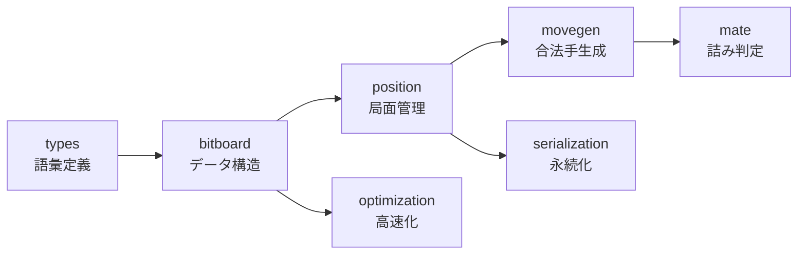

# 内部技術ドキュメント

`rsshogi` が将棋の局面と指し手をどのように表現し、合法手を生成するかを解説します。
基本型から局面管理、手生成へ順に進む構成です。

## 内部実装から得られる情報

盤面表現やビット演算をたどると、性能調査や探索エンジンとの統合に必要な前提を確認できます。

- **性能を調べる**：Bitboard 操作、利き計算、指し手生成の関係を追えます。
- **探索エンジンを書く**：`Position` の差分更新、Zobrist key、`StateInfo` の寿命を確認できます。
- **ライブラリを変更する**：座標、駒、手、局面の不変条件を章ごとに確認できます。
- **将棋プログラミングを学ぶ**：一般的なビットボードと合法手生成の考え方を、`rsshogi` の実装に沿って学べます。

## 想定読者

- Rust の基本的な型と所有権を読める開発者。
- ビット演算の基礎を理解している開発者。
- 将棋の基本ルールを知っている開発者。

## 章の並びと依存関係

各章は、基本型から局面管理と手生成へ順につながっています。
「先手歩を 1 マス前へ進める」が `>> 1` で済むのは、座標系が筋優先で並んでいるからです。
合法手生成が速いのは、駒の集合を Bitboard として持ち、`Position` が差分更新でその集合を保っているからです。
座標系から順に読むと、`Position` と合法手生成の前提を段階的に追えます。

1. **[基本型](./types/index.md)**：`Square`、`Piece`、`Move` で将棋の語彙を Rust の値に落とす
2. **[ビットボード](./bitboard/index.md)**：81 マスの集合を 128bit のビット列として扱う
3. **[局面管理](./position/index.md)**：盤、持ち駒、手番、履歴を差分更新で保つ
4. **[合法手生成](./movegen/index.md)**：王手回避や二歩を含めて手を列挙する
5. **[詰み判定](./mate/index.md)**：合法な王手と応手から一手詰めを判定する
6. **[SFEN と局面文字列](./serialization/index.md)**：局面を 1 行の文字列に落とし、[圧縮](./serialization/compression.md)や[棋譜フォーマット](./serialization/formats.md)へ広げる
7. **[パフォーマンス最適化](./optimization/index.md)**：SIMD による高速化

serialization と optimization は、position まで読んでいれば movegen より先に読めます。
mate だけは movegen の知識を前提とします。

## 目的別の読み方

**将棋プログラミングを学びたい**なら、types から movegen まで各章の導入ページだけを順にたどります。
全体像が先に入るぶん、細部で迷いにくくなります。

**API の裏側を知りたい**なら、types を全ページ読んでから serialization へ進みます。
`Square`、`Piece`、`Move` の設計意図と、棋譜フォーマットの仕組みが繋がります。

**探索エンジンを書きたい**なら、position を全ページ読み、[探索エンジンとの統合](./position/search-integration.md) から movegen、mate へ進みます。

**rsshogi に変更を加えたい**なら、全章を上の順に通読してください。
とくに [差分更新と StateInfo](./position/state-management.md) と [特殊ルール](./movegen/special-rules.md) は、
変更時に壊しやすい不変条件が集まっています。

## 盤面図の読み方

この章の盤面図は、将棋の通常表示に合わせています。

- 上端の筋番号は左から `9, 8, ..., 1`
- 右端の段は上から `一, 二, ..., 九`
- 先手の駒は読者側、後手の駒は 180 度回転して表示
- SFEN は 1 段目から 9 段目へ、各段を `/` で区切る

盤面図に添えるマス番号は rsshogi の `Square` と同じで、`file_idx * 9 + rank_idx`（どちらも 0-indexed）です。
`Square(0)` は `1a`（１一）、`Square(40)` は `5e`（５五）、`Square(80)` は `9i`（９九）になります。
画面上では 1 筋が右、9 筋が左に見えるため、インデックスの増える向きと左右方向は逆です。

## 次に読む

次は [基本型](./types/index.md) で、座標、駒、指し手の数値表現を確認します。
