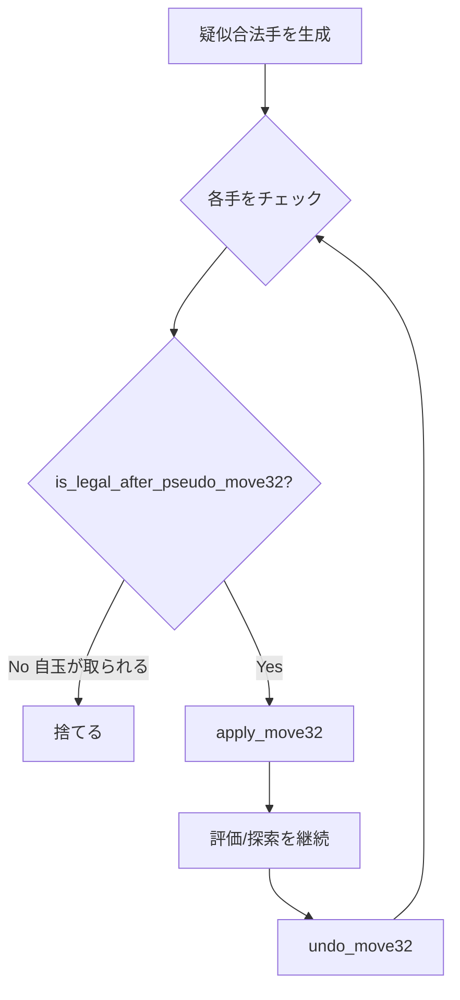

# ムーブジェネレータ

> **前提知識**: [利きの計算](../bitboard/attacks.md)（ステップ駒・遠方駒の利き生成）

ムーブジェネレータ（指し手生成器）は、与えられた局面から可能な指し手を生成する将棋エンジンの重要なコンポーネントです。
ビットボードを使用することで、複数の指し手を効率的に生成できます。

## なぜ指し手生成が重要か

探索エンジンは毎秒数百万〜数千万ノードを処理します。各ノードで指し手を生成するため、
指し手生成の速度がエンジン全体の性能を直接左右します。

将棋の指し手生成はチェスより複雑です。駒打ち・成り/不成の選択肢があるため、
合法手数がチェス（平均 35 手）の 2-3 倍に達します。

```text
初期局面:  約 30 手
中盤:      約 80-120 手（駒打ちを含む）
チェス平均: 約 35 手
```

> まずはステップ駒から始めると理解が速いです。
> 「[利きの計算](../bitboard/attacks.md)」を読んでから、本ページを読むことを推奨します。

## このページの要点

- 生成は「疑似合法手 → 適用前に `is_legal_after_pseudo_move32()` で合法性チェック → `apply_move32`」が基本です。
- 置換表やカウンタームーブの手は最小限の検証のうえで適用し、違法なら即座に捨てます。
- 打ち歩詰めや二歩などの特殊ルールは、ドロップ生成時に早期にフィルタします。
- 取り駒と静かな手は分けて生成すると Move Ordering（指し手のソート順序）が安定します。
- 性能は「集合演算で候補集合を作る → pop_lsb 列挙」で最大化します。

## 生成タイプ

`MoveGenType` トレイトと、そのマーカー型群が指し手生成のカテゴリを定義します。
`generate_moves::<T>()` の型パラメータに渡すことで、生成する手の種類を切り替えます。

```rust,ignore
{{#include ../../../../../crates/rsshogi/src/board/movegen/types.rs:movegen_generate_type}}
```
<small>[ソースコード](https://github.com/nyoki-mtl/rsshogi/blob/main/crates/rsshogi/src/board/movegen/types.rs#L13-L76)</small>

メインのエントリポイント `generate_moves` は `MoveList` を受け取り、汎用シンク版 `generate_moves_into` を介して手番ごとのカラー特化版へ委譲します。

```rust,ignore
{{#include ../../../../../crates/rsshogi/src/board/movegen/generate.rs:movegen_generate_signature}}
```
<small>[ソースコード](https://github.com/nyoki-mtl/rsshogi/blob/main/crates/rsshogi/src/board/movegen/generate.rs#L40-L47)</small>

## 処理フロー

rsshogi は合法性を**適用前**に判定します。疑似合法手を生成し、`is_legal_after_pseudo_move32(mv)`
（= 自玉が取られないかの判定）でフィルタしてから `apply_move32` します。



> **注意（`is_in_check()` の手番）**: `apply_move32(mv)` を呼ぶと手番が反転します。
> `is_in_check()` は**手番側**の玉に王手がかかっているかを返すため、適用後に呼ぶと
> 「相手玉が王手されているか（= この手が王手か）」を判定することになります。
> **自玉が王手で残っていないか（合法性）の判定には使えません**。合法性は上図のように
> 適用前の `is_legal_after_pseudo_move32(mv)`、または最初から `generate_moves::<Legal>` を
> 使って確認します。なお他のチェスエンジン解説では「apply → 自玉への王手判定 → undo」という
> コピー・メイク方式の教科書パターンを見かけますが、rsshogi はこの方式を採りません。

## 指し手の合法性レベル

指し手生成では、合法性の厳密さによって複数のレベルがあります。
それぞれのレベルには用途と性能のトレードオフがあります。

rsshogi では「どこまで検証済みか」によって、指し手を実用上 3 つのレベルで扱います。
これらは独立した別 API ではなく、`generate_moves::<T>()` の生成タイプ（マーカー型）と
合法性判定メソッドの組み合わせで表現されます。

### 1. 合法手（Legal）

完全に合法で、そのまま盤面に適用できる指し手です。
rsshogi では生成タイプ `Legal`（および王手回避専用の `Evasions`）が**生成時に自殺手をフィルタ**するため、
利用側で追加の合法性チェックは不要です。

```rust,ignore
use rsshogi::movegen::{Legal, generate_moves};
use rsshogi::board::MoveList;

let mut moves = MoveList::new();
generate_moves::<Legal>(&pos, &mut moves); // 生成時点で合法性フィルタ込み
```

**特徴:**
- 生成された指し手はすべて実行可能
- 千日手・連続王手・最大手数などの**局面レベルのルールは含まない**（探索/評価側の責務）
- 探索や詰み存在判定ではこれで十分。通常省略される不成も含む全合法手集合を外部へ返す用途では `generate_legal_all()` を使う

### 2. 疑似合法手（Pseudo-Legal）

駒の動きとしては正しいが、指すと自玉が王手で残る可能性がある指し手です。
これは合法手生成パイプラインの**内部段階**にあたり、`NonEvasions` / `Evasions` 等で候補を作ったあと、
`is_legal_after_pseudo_move32(mv)`（自玉が取られないかの判定）で絞り込みます。

```rust,ignore
// 概念: 各駒種の擬似合法手 + 駒打ちを生成し、後段で合法性を確認する。
// 実際の rsshogi では generate_moves::<Legal> がこの 2 段階を内部で行う。
// 自前で 2 段階を回したい場合は次のように書ける:
if pos.is_pseudo_legal_move32(mv, false) && pos.is_legal_after_pseudo_move32(mv) {
    // mv は合法
}
```

**特徴:**
- 自玉が王手される手を含む可能性がある
- 後段の `is_legal_after_pseudo_move32()` でフィルタする
- 候補生成自体は高速

### 3. 外部由来（置換表・履歴）の手

置換表やキラームーブなど、現局面で**まだ検証されていない**指し手です。
ハッシュ衝突などで現局面に当てはまらない可能性があるため、使う前に検証します。

```rust,ignore
// 置換表から指し手を取得
let tt_move = tt.probe(pos.key());

// 疑似合法性 → 合法性の順に確認（第2引数は全合法手モードか。通常 false）
if tt_move != Move32::NONE
    && pos.is_pseudo_legal_move32(tt_move, false)
    && pos.is_legal_after_pseudo_move32(tt_move)
{
    // 使用可能
}
```

**特徴:**
- 外部から取得した未検証の指し手
- 最低限の検証が必要
- 検証コストを抑えつつ探索を高速化できる

### 疑似合法性判定の難しさ

<details>
<summary>詳細（クリックで展開）</summary>

置換表やカウンタームーブから取得した指し手が**本当に疑似合法か**を判定することは、想像以上に困難です。

#### エッジケースの例

```rust,ignore
// 置換表から取得した指し手
let tt_move = Move32::new(Square::SQ_55, Square::SQ_54, false, false);

// 一見合法に見えるが...
// - 5五に本当に駒があるか？
// - その駒は5四に移動できる種類か？
// - ハッシュ衝突で別の局面の手が混入していないか？
```

**典型的な問題**:

1. **ハッシュ衝突**: 異なる局面が同じハッシュ値を持つ場合、置換表から取得した指し手が現在の局面では無効
2. **駒種の不一致**: 移動元のマスに期待した駒がない（例: 銀の手だが実際は歩がある）
3. **移動範囲の違反**: 駒はあるが、その駒種では到達不可能な場所への移動

#### 完全な検証の難しさ

完全に正確な疑似合法性判定には、以下をすべてチェックする必要があります：

```rust,ignore
fn is_pseudo_legal_comprehensive(position: &Position, mv: Move32) -> bool {
    // 1. 移動元に自分の駒があるか
    let from_piece = position.piece_at(mv.from());
    if from_piece == Piece::NONE || from_piece.color() != position.side_to_move() {
        return false;
    }

    // 2. 移動先に自分の駒がないか（駒取り以外）
    let to_piece = position.piece_at(mv.to());
    if to_piece != Piece::NONE && to_piece.color() == position.side_to_move() {
        return false;
    }

    // 3. その駒種で移動可能な範囲か
    let legal_moves = generate_piece_attacks(from_piece, mv.from(), position.occupied());
    if !legal_moves.contains(mv.to()) {
        return false;
    }

    // 4. 成りのルールを満たしているか
    if mv.is_promotion() {
        if !is_promotable_move(mv.from(), mv.to(), position.side_to_move()) {
            return false;
        }
    }

    // 5. 行き所のない駒になっていないか
    if !mv.is_promotion() {
        let piece_after = if mv.is_promotion() { from_piece.promote() } else { from_piece };
        if !has_legal_move_from(piece_after, mv.to(), position.side_to_move()) {
            return false;
        }
    }

    // 6. 駒打ちの場合の特別ルール
    if mv.is_drop() {
        // 二歩、打ち歩詰め、持ち駒の有無など
        // ...
    }

    true
}
```

このような完全な検証は、指し手生成と同じくらいコストがかかります。

#### 実用的な妥協案

多くのエンジンは、性能とのトレードオフとして**最小限の検証**のみを行います：

```rust,ignore
fn is_pseudo_legal_fast(position: &Position, mv: Move32) -> bool {
    // 最低限のチェックのみ
    let from_piece = position.piece_at(mv.from());

    // 移動元に自分の駒があるか
    if from_piece.color() != position.side_to_move() {
        return false;
    }

    // 移動先に自分の駒がないか
    let to_piece = position.piece_at(mv.to());
    if to_piece != Piece::NONE && to_piece.color() == position.side_to_move() {
        return false;
    }

    // 詳細な移動可能性はチェックしない（do_move後にエラーとなる）
    true
}
```

#### メモリとのトレードオフ

より厳密な検証を行うには、置換表やカウンタームーブテーブルに**駒種情報**を保存する必要があります：

```rust,ignore
// 駒種を含む置換表エントリ（メモリ消費増）
struct TTEntry {
    hash: u64,
    best_move: Move32,
    piece_type: PieceType,  // 追加情報
    score: i32,
    depth: u8,
}
```

しかし、これはメモリ消費を増やし、キャッシュ効率を低下させる可能性があります。

#### 推奨アプローチ

1. **置換表の手**: 最小限の検証 + 適用前の `is_legal_after_pseudo_move32()`
2. **カウンタームーブ**: 駒種情報を含めて保存（メモリ許容範囲内）
3. **生成した疑似合法手**: 検証不要（信頼できる）

<details>
<summary>実装例コード（クリックで展開）</summary>

```rust,ignore
fn try_hash_move(position: &mut Position, tt_move: Move32) -> Option<i32> {
    // 最小限の検証（rsshogi の is_pseudo_legal_move32。第2引数は全合法手モードか）
    if !position.is_pseudo_legal_move32(tt_move, false) {
        return None;
    }

    // 自玉が取られないか（合法性）は適用前に判定する
    if !position.is_legal_after_pseudo_move32(tt_move) {
        return None;  // 自玉が王手で残る違法手
    }

    // 適用して探索（StateInfo は内部の StateStack が自動管理）
    position.apply_move32(tt_move);

    // 合法手として探索続行
    let score = -search(position, depth - 1);
    position.undo_move32(tt_move).ok()?;
    Some(score)
}
```

</details>

#### まとめ

疑似合法性判定は「マジで難しい」（やねうら王ブログより）問題であり、完全な実装は以下の理由で困難です：

- エッジケースが多数存在
- 完全な検証は指し手生成と同等のコスト
- メモリとのトレードオフ
- ハッシュ衝突への対処が必要

実用的には、**疑似合法性の最小限の検証 + 適用前の `is_legal_after_pseudo_move32()`** で落とすのが最も効率的です。

</details>

## なぜ疑似合法手を使うのか

### パフォーマンス vs 正確性

完全な合法性判定には、指し手を実際に適用して自玉が王手されないか確認する必要があります：

<details>
<summary>実装例コード（クリックで展開）</summary>

```rust,ignore
fn is_truly_legal(position: &Position, mv: Move32) -> bool {
    // rsshogi では適用前に「自玉が取られないか」を判定する。
    // （apply 後に is_in_check() を見ると手番反転で相手玉の王手判定になってしまう点に注意）
    position.is_pseudo_legal_move32(mv, false)
        && position.is_legal_after_pseudo_move32(mv)
}
```

</details>

この判定はコストが大きい処理です。
そのため、探索では以下の戦略を取ります：

<details>
<summary>実装例コード（クリックで展開）</summary>

```rust,ignore
fn search(position: &mut Position, depth: i32) -> i32 {
    // 1. 高速に擬似合法手を生成（StateInfo は内部自動管理）
    let moves = generate_pseudo_legal_moves(position);

    for mv in moves {
        // 2. 適用「前」に合法性を確認（自玉が取られる手を捨てる）
        //    apply 後に is_in_check() を見ると手番反転で相手玉の判定になる点に注意
        if !position.is_legal_after_pseudo_move32(mv) {
            continue; // 違法手 → 適用せずに次の手へ
        }

        // 3. 合法手だけを適用して探索続行
        position.apply_move32(mv);
        let score = -search(position, depth - 1);
        position.undo_move32(mv).ok();
        // ...
    }
}
```

</details>

### 統計的な効率性

実際の局面では、疑似合法手のうちほとんどが合法手です：

疑似合法手: 平均 80-100 手
違法手（自玉王手）: 平均 0-3 手

```text
違法手の割合: 約 0-5%
```

つまり、擬似合法手の 95% 以上はそのまま合法手です。
全手をまとめて先に検証するより、各手を**試す直前**に `is_legal_after_pseudo_move32()` で確認する方が、
早期カットで打ち切られた手の検証を省けて効率的です。

### 探索の早期カット

Alpha-Beta探索では、多くの手が評価される前にカットオフされます：

```rust,ignore
fn alpha_beta(position: &mut Position, alpha: i32, beta: i32, depth: i32) -> i32 {
    let moves = generate_pseudo_legal_moves(position);

    for mv in moves {
        // 適用「前」に合法性を確認（違法手は探索しない）
        if !position.is_legal_after_pseudo_move32(mv) {
            continue;
        }

        position.apply_move32(mv);
        let score = -alpha_beta(position, -beta, -alpha, depth - 1);
        position.undo_move32(mv).ok();

        if score >= beta {
            return beta;  // βカット：残りの手を探索しない
        }
    }
}
```

早期カットにより、多くの手はそもそも試されません（合法性チェックも `apply_move32()` も行われない）。
だからこそ、合法性の確認は「その手を試す直前」に行うのが効率的です。

## 指し手生成の段階的戦略

実際の探索では、指し手を段階的に生成します：

### MovePicker パターン

> **注意**: `MovePicker` は rsshogi コアライブラリが提供するものではなく、
> **探索エンジン側が実装するコンポーネント**です。
> rsshogi はビルディングブロック（`generate_moves::<Captures>()` / `generate_moves::<QuietsProMinus>()` など）を提供し、
> 「どの順番でどの種類の手を試すか」はエンジン側で決定します。

以下は探索エンジン側での実装イメージ（概念コード、実 API は `rsshogi::movegen::*` を参照）：

```rust,ignore
// これは探索エンジン側のコード例（rsshogi 自体は提供しない）
pub struct MovePicker {
    stage: GenerationStage,
    captures: Move32List,
    quiets: Move32List,
    index: usize,
}

enum GenerationStage {
    HashMove,   // 置換表の手（最初に試す）
    Captures,   // 駒を取る手（高価値）
    Killers,    // キラームーブ（履歴的に良い手）
    Quiets,     // 静かな手（駒を取らない）
}
```

### なぜ段階的に生成するのか

1. **早期カット**: 良い手を先に試すことで、残りの手の生成を避けられる
2. **選択的生成**: 必要な種類の手だけを生成する
3. **メモリ効率**: すべての手を一度に保持する必要がない

```rust,ignore
// 使用例（探索エンジン側のコード）
while let Some(mv) = picker.next() {
    // 適用「前」に合法性を確認
    if !position.is_legal_after_pseudo_move32(mv) {
        continue;
    }

    position.apply_move32(mv);
    let score = -search(position, depth - 1);
    position.undo_move32(mv).ok();

    if score >= beta {
        // βカット：残りの手は生成されない
        return beta;
    }
}
```

## 駒種別の指し手生成

### ステップ駒（歩、桂、銀、金、玉）

```rust,ignore
fn generate_pawn_moves(position: &Position, moves: &mut Vec<Move32>) {
    let us = position.side_to_move();
    let pawns = position.pieces_cp(us, PieceType::PAWN);
    let empty = !position.occupied();

    // 前に1マス進む
    let targets = pawns.shift_forward(us) & empty;

    for to in targets {
        let from = to.shift_backward(us);

        // 成り判定
        if is_promotable_square(to, us) || is_promotable_square(from, us) {
            moves.push(Move32::new(from, to, false, true));   // 成る
            if to.rank() != 0 && to.rank() != 8 {
                moves.push(Move32::new(from, to, false, false)); // 不成
            }
        } else {
            moves.push(Move32::new(from, to, false, false));
        }
    }
}
```

### 遠方駒（飛車、角）

```rust,ignore
fn generate_rook_moves(position: &Position, moves: &mut Vec<Move32>) {
    let us = position.side_to_move();
    let rooks = position.pieces_cp(us, PieceType::ROOK);
    let occupied = position.occupied();

    for from in rooks {
        // 遠方駒の利きを取得（rsshogi は Qugiy 方式。Magic Bitboard ではない）
        let attacks = rook_attacks(from, occupied);

        // 自分の駒がある場所は除外
        let targets = attacks & !position.pieces(us);

        for to in targets {
            // 成り判定
            if is_promotable_square(from, us) || is_promotable_square(to, us) {
                moves.push(Move32::new(from, to, false, true));
                moves.push(Move32::new(from, to, false, false));
            } else {
                moves.push(Move32::new(from, to, false, false));
            }
        }
    }
}
```

## 駒打ちの生成

```rust,ignore
fn generate_drops(position: &Position, moves: &mut Vec<Move32>) {
    let us = position.side_to_move();
    let empty = !position.occupied();
    let hand = position.hand(us);

    for piece_type in PieceType::hand_pieces() {
        if hand.count(piece_type) == 0 {
            continue;
        }

        // 打てる場所
        let mut targets = empty;

        // 歩の制約
        if piece_type == PieceType::PAWN {
            // 二歩チェック
            for file in 0..9 {
                let file_mask = Bitboard::file_bb(file);
                if (position.pieces_cp(us, PieceType::PAWN) & file_mask).any() {
                    targets &= !file_mask;
                }
            }

            // 1段目には打てない
            targets &= !Bitboard::rank_bb(if us == Color::BLACK { 8 } else { 0 });
        }

        // 香・桂の制約（行き所のない駒）
        if piece_type == PieceType::LANCE {
            targets &= !Bitboard::rank_bb(if us == Color::BLACK { 8 } else { 0 });
        } else if piece_type == PieceType::KNIGHT {
            let forbidden = if us == Color::BLACK {
                Bitboard::rank_bb(8) | Bitboard::rank_bb(7)
            } else {
                Bitboard::rank_bb(0) | Bitboard::rank_bb(1)
            };
            targets &= !forbidden;
        }

        // 指し手を生成
        for to in targets {
            moves.push(Move32::drop(to, piece_type));
        }
    }
}
```

## 王手回避手の生成

王手されている局面では、特別な指し手生成が必要です：

```rust,ignore
fn generate_evasions(position: &Position) -> Vec<Move32> {
    let mut moves = Vec::new();
    let us = position.side_to_move();
    let king_sq = position.king_square(us);

    // 王手している駒
    let checkers = position.checkers();

    if checkers.count() == 1 {
        // 1枚王手：玉の移動・王手している駒を取る・合駒
        let checker_sq = checkers.first_one().unwrap();

        // 1. 玉の移動
        generate_king_moves(position, &mut moves);

        // 2. 王手駒を取る
        generate_captures_to(position, checker_sq, &mut moves);

        // 3. 合駒（飛び利きの場合のみ）
        if is_slider_check(position, checker_sq, king_sq) {
            let between = between_bb(checker_sq, king_sq);
            generate_interpositions(position, between, &mut moves);
        }
    } else {
        // 両王手：玉の移動のみ
        generate_king_moves(position, &mut moves);
    }

    moves
}
```

## Move32 リストの直接生成

探索や perft では `Move32`（駒情報付き 32bit 指し手）が必要になります。
通常の `MoveList`（16bit `Move`）で生成してから `move32_from_move()` で変換すると、
1手ごとに `piece_on` 参照が発生します。

rsshogi では `MoveSink` トレイトの駒情報付きメソッド（`push_normal(from, to, piece)` 等）を活用した
**アダプタパターン**で、生成パイプライン内の駒情報を直接 `Move32` に埋め込みます。
`Move32List` に書くケースだけでなく、外部クレートの独自コンテナへ直接流し込む
`Move32Sink` も公開されています。

```rust,ignore
// MoveList (16bit) での生成
let mut moves = MoveList::new();
generate_legal_all(&pos, &mut moves);

// Move32List (32bit) での直接生成（piece_on 参照不要）
let mut moves32 = Move32List::new();
generate_legal_all_move32(&pos, &mut moves32);
```

```rust,ignore
use rsshogi::board::movegen::Move32Sink;
use rsshogi::movegen::Legal;

struct ExtMoveSink {
    moves: Vec<Move32>,
}

impl Move32Sink for ExtMoveSink {
    fn push_move32(&mut self, mv: Move32) {
        self.moves.push(mv);
    }

    fn retain_unordered<F>(&mut self, mut f: F)
    where
        F: FnMut(Move32) -> bool,
    {
        self.moves.retain(|&mv| f(mv));
    }
}

let mut sink = ExtMoveSink { moves: Vec::new() };
rsshogi::board::movegen::generate_moves_move32_into::<Legal>(&pos, &mut sink);
```

内部的には `Move32SinkAdapter` が `MoveSink` を実装し、
各生成関数から渡される `Piece` 情報をビット操作で `Move32` に直接埋め込みます。
参照実装がテンプレートパラメータで駒種を伝播するのと同等の効率を実現しています。

## パフォーマンス最適化

### ビットボードの活用

```rust,ignore
// 悪い例：1マスずつチェック
for to in 0..81 {
    if is_valid_pawn_move(from, to) {
        moves.push(Move32::new(from, to, false, false));
    }
}

// 良い例：ビットボードで一括処理
let targets = pawn_attacks(from) & !position.pieces(us);
for to in targets {
    moves.push(Move32::new(from, to, false, false));
}
```

### 指し手の事前ソート

探索エンジン側でスコア付きの指し手リストを管理し、良い手を先に探索してβカットを増やします。
典型的には置換表の手を最優先し、MVV-LVA（取る駒の価値 - 取られる駒の価値）や
History heuristic などのヒューリスティクスでスコアリングします。

## まとめ

効率的な指し手生成は、将棋エンジンの性能を左右する重要な要素です：

- **疑似合法手の生成**: 高速。適用前に `is_legal_after_pseudo_move32()` で合法性を確認
- **段階的な生成**: 良い手を優先して、早期カットを促進
- **ビットボードの活用**: 複数の指し手を一括処理
- **Move Ordering（指し手のソート順序）**: 探索効率を大幅に向上

適切な指し手生成戦略により、毎秒数千万ノードの探索速度を実現できます。

## 将棋固有の考慮事項

チェスの指し手生成と比較して、将棋には以下の追加的な複雑さがあります。

| 項目 | チェス | 将棋 |
|------|--------|------|
| 駒打ち | なし | 7 駒種 × 空マス数（平均 40-50 手を追加） |
| 成り/不成 | Pawn のみ → 他駒種に変身 | 6 駒種 × 成りゾーンで選択（手数が倍増） |
| 二歩 | なし | 歩の打ち先を筋ごとにフィルタ |
| 打ち歩詰め | なし | 歩打ち後に詰み判定が必要 |
| 行き所のない駒 | なし | 桂(1-2段)・香(1段)・歩(1段)に打てない |

特に駒打ちの生成は将棋エンジン独自の処理であり、空マスの列挙と各駒種の制約チェックを
ビットボード演算で一括処理することが性能の鍵です。

## 次に読む

→ **[特殊ルール](./special-rules.md)**: 千日手・打ち歩詰め・二歩・入玉宣言など、指し手生成に関わる特殊ルールの実装を解説します。

## 参考資料

- [やねうら王mini連載 12日目: 指し手の合法性](https://yaneuraou.yaneu.com/2015/12/24/) - 合法性レベルの分類
- [やねうら王 - pseudo legalの判定がマジで難しい件](https://yaneuraou.yaneu.com/2016/02/28/pseudo-legal%e3%81%ae%e5%88%a4%e5%ae%9a%e3%81%8c%e3%83%9e%e3%82%b8%e3%81%a7%e9%9b%a3%e3%81%97%e3%81%84%e4%bb%b6/) - 疑似合法性判定の実装上の課題
- [Chess Programming Wiki - Move Generation](https://www.chessprogramming.org/Move_Generation) - 各種生成手法
- [Chess Programming Wiki - Pseudo-Legal Move](https://www.chessprogramming.org/Pseudo-Legal_Move) - 疑似合法手の理論
- [Stockfish - Movegen](https://github.com/official-stockfish/Stockfish) - 実装例
